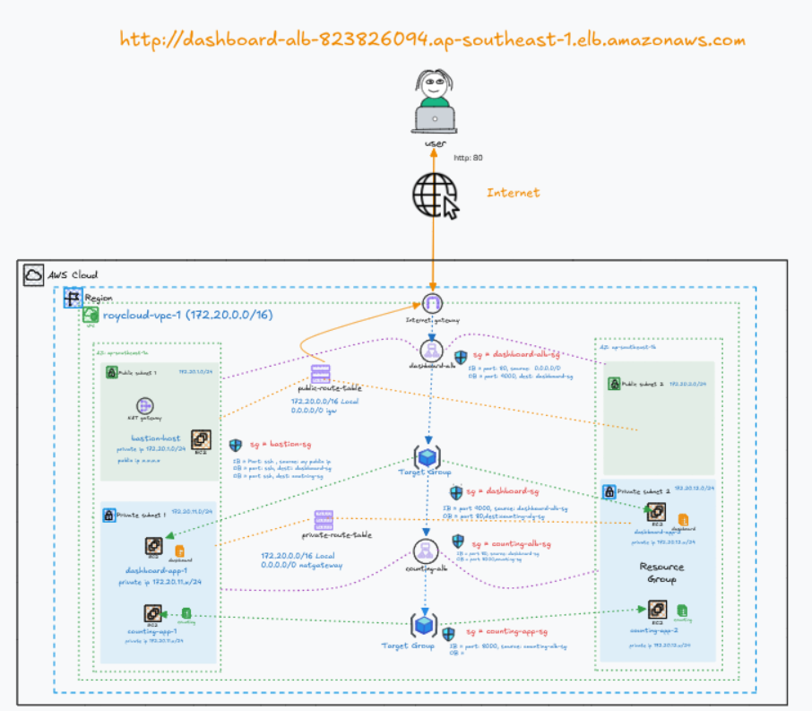
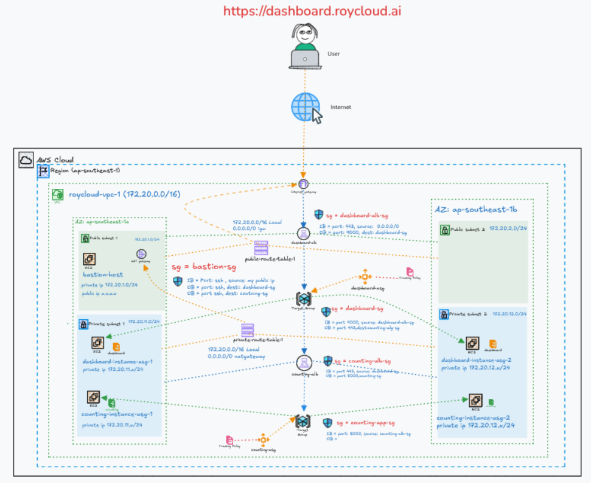
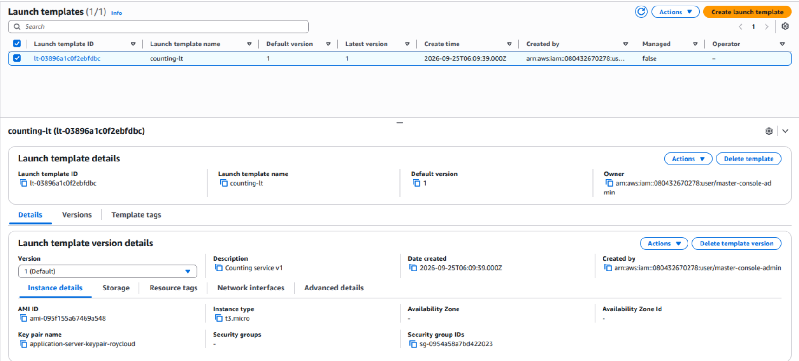
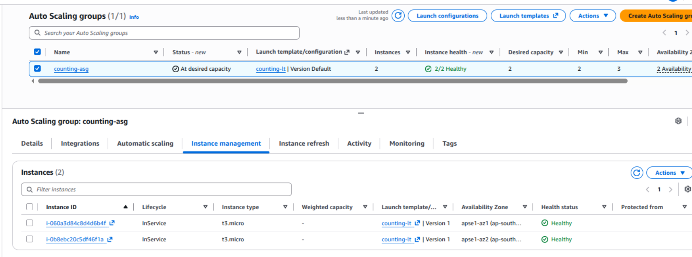
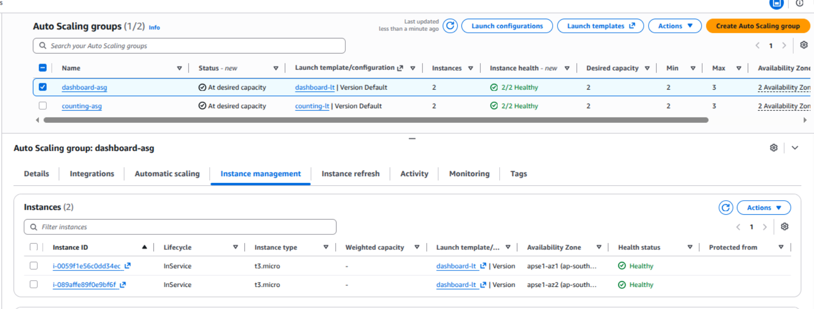
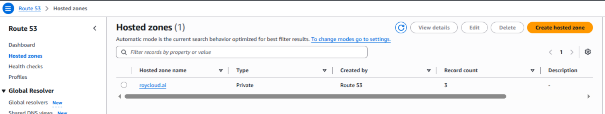
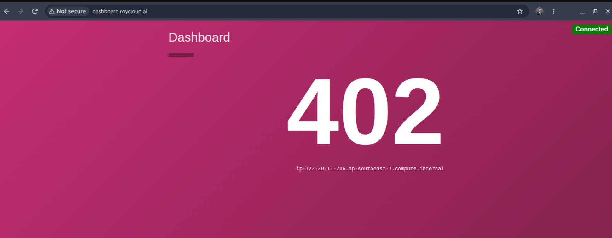
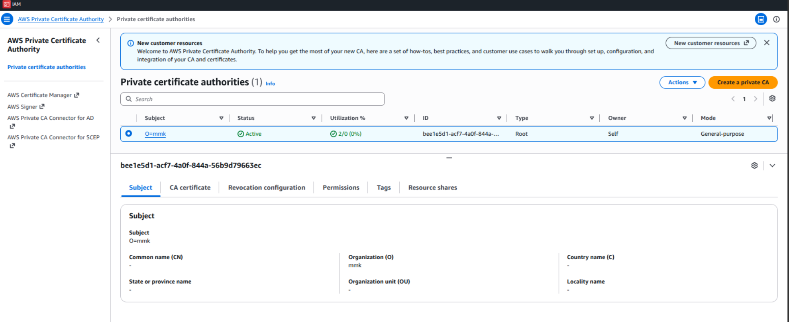
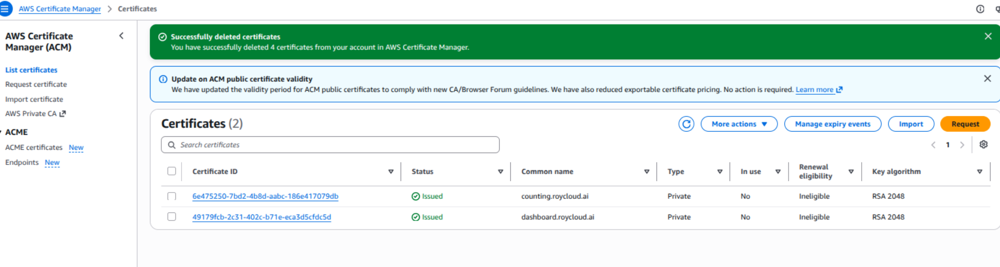
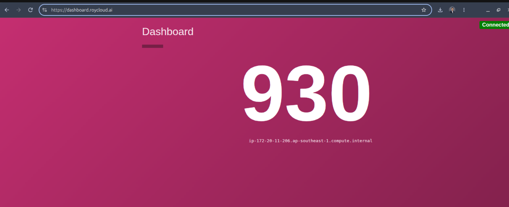

# 1. Existing Infrastructure (In Lab 3)

Dashboard and Counting EC2 instances across two Availability Zones, runs each application mannually with a dedicated service user, and distributes traffic through public and internal Application Load Balancers.




# 2. Upgrade Design and Infrastructure



# 3. Planning

## 1. Existing Resources to Reuse from Lab-3

- VPC and subnets across two Availability Zones
- Internet Gateway and NAT Gateway
- Bastion host
- Dashboard and Counting ALBs
- Dashboard and Counting target groups
- Existing security groups

## 2. Resource Plan

| Component          | Dashboard                | Counting                 |
| ------------------ | ------------------------ | ------------------------ |
| AMI                | Amazon Linux 2023 x86_64 | Amazon Linux 2023 x86_64 |
| Application port   | `9000`                   | `8000`                   |
| Launch Template    | `dashboard-lt`           | `counting-lt`            |
| Auto Scaling Group | `dashboard-asg`          | `counting-asg`           |
| Subnets            | Two private subnets      | Two private subnets      |
| Minimum capacity   | 2                        | 2                        |
| Desired capacity   | 2                        | 2                        |
| Maximum capacity   | 3                        | 3                        |
| Target group       | `dashboard-tg`           | `counting-tg`            |
| Health check       | ELB                      | ELB                      |
| Scaling policy     | Target tracking          | Target tracking          |
| Target CPU         | 60%                      | 60%                      |

## 3. DNS Plan

# Create a Route 53 Private Hosted Zone:
  E.g roycloud.ai

# Create Alias records:

dashboard.<private-domain> → Dashboard ALB
counting.<private-domain>  → Counting ALB

The private DNS names resolve only from the associated VPC.

## 4. TLS Plan

- Create one AWS Private CA.
- Request ACM private certificates for both DNS names.
- Attach the Dashboard certificate to its ALB HTTPS listener.
- Attach the Counting certificate to its internal ALB HTTPS listener.
- Configure HTTPS listener port `443`.
- Forward ALB traffic to EC2 application ports using HTTP.
- Install the Private CA root certificate on trusted clients.
- Configure Dashboard with:

COUNTING_SERVICE_URL=https://counting.<private-domain>

## 5. Security Group Plan

|Security group|Mandatory inbound rule|
|---|---|
|Dashboard ALB SG|HTTPS `443` from approved clients|
|Dashboard EC2 SG|TCP `9000` from Dashboard ALB SG|
|Counting ALB SG|HTTPS `443` from Dashboard EC2 SG|
|Counting EC2 SG|TCP `8000` from Counting ALB SG|

Allow outbound HTTP/HTTPS from private EC2 instances through the NAT Gateway for User Data downloads.

## 6. Mandatory ASG Settings

Health check type: ELB
Health check grace period: 300 seconds
Default instance warmup: 300 seconds
Minimum: 2
Desired: 2
Maximum: 3


# 3. Implementation

## 3.1 Create Counting Launch Template

EC2 Console → Launch Templates → Create launch template


Inputs:

| Field                        | Value                         |
| ---------------------------- | ----------------------------- |
| Launch template name         | `counting-lt`                 |
| Template version description | `Counting service v1`         |
| AMI                          | Amazon Linux 2023, x86_64     |
| Instance type                | `t3.micro`                    |
| Key pair                     | existing application-key-pair |
| Security group               | `counting-sg`                 |
| Subnet                       | Do not specify                |
| Public IP                    | Disabled                      |
| Storage                      | Default root volume           |
| Metadata version             | IMDSv2 required               |
Resource Tags


Name = counting-asg-instance
Application = counting-service


### Counting User Data

Paste the verified Counting User Data script.
```bash
#!/bin/bash

# Write User Data output to the log file
exec > /var/log/user-data.log 2>&1
set -e

APP_URL="https://github.com/hashicorp/demo-consul-101/releases/download/v0.0.5/counting-service_linux_amd64.zip"

# Install unzip
# Amazon Linux 2023 already includes curl-minimal
dnf update -y 
dnf install -y unzip

# Download and extract the application
cd /tmp
curl -fLO "$APP_URL"
unzip -o counting-service_linux_amd64.zip

# Create the dedicated group
getent group counting-user >/dev/null || \
  groupadd --system counting-user

# Create the dedicated non-login user
id counting-user >/dev/null 2>&1 || \
  useradd --system \
    --gid counting-user \
    --no-create-home \
    --shell /sbin/nologin \
    counting-user

# Create the application directory
mkdir -p /opt/counting-service

# Install the application binary
mv -f counting-service_linux_amd64 \
  /opt/counting-service/counting-service

chown -R counting-user:counting-user /opt/counting-service
chmod 750 /opt/counting-service/counting-service

# Create the systemd service
cat > /etc/systemd/system/counting-service.service <<'EOF'
[Unit]
Description=HashiCorp Demo Counting Service
After=network-online.target
Wants=network-online.target

[Service]
Type=simple
User=counting-user
Group=counting-user
WorkingDirectory=/opt/counting-service
Environment="PORT=8000"
ExecStart=/opt/counting-service/counting-service
Restart=always
RestartSec=5

[Install]
WantedBy=multi-user.target
EOF

# Reload systemd and start the service
systemctl daemon-reload
systemctl start counting-service
systemctl enable --now counting-service
```
[!Note]
Do not select a subnet in the Launch Template. The Counting Auto Scaling Group will select the two private subnets later.



## 3.2 Create Counting Auto Scaling Group

### 1. Choose Launch Template

Auto Scaling group name : counting-asg
Launch template : counting-lt
Version : Default

### 2. Choose Network

VPC: vpc-01-roycloud
AZ : ap-southeast-1a (prviate-subnet-1-roycloud), ap-southeast-1b ((prviate-subnet-2-roycloud)


### 3. Attach Load Balancer

Attach to an existing load balancer : Choose from your load balancer target groups

Target group: counting-tg
Enable: Elastic Load Balancing health checks
Health check grace period: 300 seconds

### 4. Configure Capacity

| Setting          | Value |
| ---------------- | ----- |
| Desired capacity | 2     |
| Minimum capacity | 2     |
| Maximum capacity | 3     |

Do not configure the scaling policy yet.

### 5. Add Tags

| Key           | Value                   | Propagate |
| ------------- | ----------------------- | --------- |
| `Name`        | `counting-asg-instance` | Yes       |
| `Application` | `counting-service`      | Yes       |

[!Note]
Wait until:
ASG instances: InService
Target group: Both targets Healthy

### 3.2.1 Verify Counting ASG

### Console Checks

EC2 → Auto Scaling Groups → counting-asg → Instance management

Expected:
2 instances
Lifecycle state: InService
Health status: Healthy

Check:
EC2 → Target Groups → counting-tg → Targets


Expected:
Both ASG instances: Healthy
Port: 8000

Connect through the Bastion host, then run:
```bash
sudo cloud-init status --long
sudo systemctl status counting-service --no-pager
sudo ss -lntp | grep 8000
curl http://localhost:8000/health
```

Expected:
```
status: done
active (running)
Port 8000 listening
HTTP 200
```




## 3.3 Create Dashboard Launch Template

EC2 → Launch Templates → Create launch template

Mandatory Inputs:

| Field                | Value                            |
| -------------------- | -------------------------------- |
| Launch template name | `dashboard-lt`                   |
| Version description  | `Dashboard service v1`           |
| AMI                  | Amazon Linux 2023, x86_64        |
| Instance type        | `t3.micro`                       |
| Key pair             | Existing bastion-access key pair |
| Security group       | `dashboard-sg`                   |
| Subnet               | Do not specify                   |
| Public IP            | Disabled                         |
| Metadata version     | IMDSv2 required                  |
| Storage              | Default root volume              |

### Dashboard User Data Requirement

Use the Amazon Linux version:

```bash
dnf install -y unzip
```

# Dashboard-User-data

```bash

#!/bin/bash

# Write User Data output to the log file
exec > /var/log/user-data.log 2>&1
set -e

export DEBIAN_FRONTEND=noninteractive

APP_URL="https://github.com/hashicorp/demo-consul-101/releases/download/v0.0.5/dashboard-service_linux_amd64.zip"
COUNTING_URL="http://internal-counting-alb-1837282896.ap-southeast-1.elb.amazonaws.com"

# Install required packages
dnf update -y 
dnf install -y unzip

# Download and extract the application
cd /tmp
curl -fLO "$APP_URL"
unzip -o dashboard-service_linux_amd64.zip

# Create the dedicated group and user
getent group dashboard-user >/dev/null || \
  groupadd --system dashboard-user

id dashboard-user >/dev/null 2>&1 || \
  useradd --system \
    --gid dashboard-user \
    --no-create-home \
    --shell /usr/sbin/nologin \
    dashboard-user

# Create the application directory
mkdir -p /opt/dashboard-service

mv -f dashboard-service_linux_amd64 \
  /opt/dashboard-service/dashboard-service

chown -R dashboard-user:dashboard-user /opt/dashboard-service
chmod 750 /opt/dashboard-service/dashboard-service

# Create the systemd service
cat > /etc/systemd/system/dashboard-service.service <<EOF
[Unit]
Description=HashiCorp Demo Dashboard Service
After=network-online.target
Wants=network-online.target

[Service]
Type=simple
User=dashboard-user
Group=dashboard-user
WorkingDirectory=/opt/dashboard-service
Environment="PORT=9000"
Environment="COUNTING_SERVICE_URL=${COUNTING_URL}"
ExecStart=/opt/dashboard-service/dashboard-service
Restart=always
RestartSec=5

[Install]
WantedBy=multi-user.target
EOF

# Reload, enable and start the service
systemctl daemon-reload
systemctl restart dashboard-service.service
systemctl enable --now dashboard-service
```

Set the current Counting URL:
COUNTING_URL="http://counting.lab.roycloud.ai"


If private DNS has not been created yet, temporarily use:
COUNTING_URL="http://internal-counting-alb-1837282896.ap-southeast-1.elb.amazonaws.com"


### Resource Tags

| Key           | Value                    |
| ------------- | ------------------------ |
| `Name`        | `dashboard-asg-instance` |
| `Application` | `dashboard-service`      |
| `Lab`         | `lab-04`                 |
[!Note]
Do not select private subnets in the Launch Template. They will be selected in the Dashboard Auto Scaling Group.

## 3.4 Create Dashboard Auto Scaling Group

EC2 → Auto Scaling Groups → Create Auto Scaling group

### 1. Choose Launch Template

| Field                   | Value           |
| ----------------------- | --------------- |
| Auto Scaling group name | `dashboard-asg` |
| Launch template         | `dashboard-lt`  |
| Version                 | Default         |

### 2. Choose Network

| Field              | Value                                                |
| ------------------ | ---------------------------------------------------- |
| VPC                | vpc-01-roycloud                                      |
| Availability Zones | ap-southeast-1a, ap-southeast-1b                     |
| Subnets            | private-subnet-1-roycloud, private-subent-2-roycloud |

### 3. Attach Target Group

Attach to an existing load balancer: Choose from your load balancer target groups
Target group: dashboard-tg
Enable: Elastic Load Balancing health checks
Health check grace period: 300 seconds


### 4. Configure Capacity

| Setting          | Value |
| ---------------- | ----- |
| Desired capacity | 2     |
| Minimum capacity | 2     |
| Maximum capacity | 3     |

Do not configure a scaling policy yet.

### 5. Add Tags

| Key           | Value                    | Propagate |
| ------------- | ------------------------ | --------- |
| `Name`        | `dashboard-asg-instance` | Yes       |
| `Application` | `dashboard-service`      | Yes       |

Wait until:

ASG instances: InService
dashboard-tg targets: Healthy

Keep the old Dashboard instance until both ASG-created Dashboard instances are healthy.



## 3.3 Create Private Hosted Zone

Route 53 → Hosted zones → Create hosted zone

Input:

| Field       | Value               |
| ----------- | ------------------- |
| Domain name | `roycloud.ai`       |
| Type        | Private hosted zone |
| Region      | `ap-southeast-1`    |
| VPC         | vpc-01-roycloud     |



### 3.3.1 Create Counting DNS Record

Inside the hosted zone, select:

Create record

|Field|Value|
|---|---|
|Record name|`counting`|
|Record type|`A`|
|Alias|Enabled|
|Route traffic to|Application Load Balancer|
|Region|`ap-southeast-1`|
|Load balancer|Internal Counting ALB|
|Evaluate target health|Yes|

Result:
counting.roycloud.ai → Internal Counting ALB




Test the application:

```bash
curl -v http://counting.lab.roycloud.ai/health
```

Expected:

```bash
[ec2-user@ip-172-20-12-12 ~]$ curl -v http://counting.roycloud.ai/health
* Host counting.roycloud.ai:80 was resolved.
* IPv6: (none)
* IPv4: 172.20.12.35, 172.20.11.64
*   Trying 172.20.12.35:80...
* Established connection to counting.roycloud.ai (172.20.12.35 port 80) from 172.20.12.12 port 59286 
* using HTTP/1.x
> GET /health HTTP/1.1
> Host: counting.roycloud.ai
> User-Agent: curl/8.21.0
> Accept: */*
> 
* Request completely sent off
< HTTP/1.1 200 OK
< Date: Fri, 25 Sep 2026 07:54:59 GMT
< Content-Type: text/plain; charset=utf-8
< Content-Length: 26
< Connection: keep-alive
< 
Hello, you've hit /health
* Connection #0 to host counting.roycloud.ai:80 left intact
```

This private DNS name will not resolve from a normal public internet connection.
## Create Dashboard Private DNS Record

```
Route 53 → Hosted zones → roycloud.ai → Create record
```

Mandatory Inputs:

| Field                  | Value                     |
| ---------------------- | ------------------------- |
| Record name            | `dashboard`               |
| Record type            | `A`                       |
| Alias                  | Enabled                   |
| Route traffic to       | Application Load Balancer |
| Region                 | `ap-southeast-1`          |
| Load balancer          | Dashboard ALB             |
| Routing policy         | Simple                    |
| Evaluate target health | Yes                       |

Select:
Create records

The result will be:
dashboard.roycloud.ai → Dashboard ALB


## Verify Inside the Associated VPC

```bash
nslookup dashboard.roycloud.ai. 172.20.0.2
```

Test the Dashboard:
```bash
curl -v http://dashboard.roycloud.ai/health
```

Or test the application page:

```bash
curl -v http://dashboard.roycloud.ai/
```

Expected:

```bash
[ec2-user@ip-172-20-12-12 ~]$ curl -v http://dashboard.roycloud.ai/health
* Host dashboard.roycloud.ai:80 was resolved.
* IPv6: (none)
* IPv4: 54.179.17.31, 54.179.18.56
*   Trying 54.179.17.31:80...
* Established connection to dashboard.roycloud.ai (54.179.17.31 port 80) from 172.20.12.12 port 46770 
* using HTTP/1.x
> GET /health HTTP/1.1
> Host: dashboard.roycloud.ai
> User-Agent: curl/8.21.0
> Accept: */*
> 
* Request completely sent off
< HTTP/1.1 200 OK
< Date: Fri, 25 Sep 2026 07:53:38 GMT
< Content-Type: text/plain; charset=utf-8
< Content-Length: 26
< Connection: keep-alive
< 
Hello, you've hit /health
* Connection #0 to host dashboard.roycloud.ai:80 left intact
```

Because this record is in a Private Hosted Zone, it will resolve only inside the associated VPC, not directly from your local computer on the public internet.


## Access Dashboard Private DNS from Local Computer Using `/etc/hosts`

This is a temporary method for an internet-facing Dashboard ALB.

### 1. Find the Dashboard ALB IP

Connect to the Dashboard EC2 through the Bastion host.

Run:
```bash
nslookup dashboard.roycloud.ai
```

Example result:
```
Name: dashboard-alb-123.ap-southeast-1.elb.amazonaws.com
Address: 13.214.100.20
Address: 18.141.50.10
```

Copy the returned IP addresses.

### 2. Update `/etc/hosts` on Your Local Computer

On your local Ubuntu computer:

```bash
sudo nano /etc/hosts
```

Add the returned ALB IP address and Dashboard DNS name:
```bash
13.214.100.20 dashboard.roycloud.ai
```

If two IP addresses were returned, you can add both:
```bash
13.214.100.20 dashboard.roycloud.ai
18.141.50.10 dashboard.roycloud.ai
```

Save the file:
Ctrl+O → Enter → Ctrl+X


### 3. Verify Local Name Resolution

```
getent hosts dashboard.roycloud.ai
```

Do not use `nslookup` for this verification because `nslookup` does not read `/etc/hosts`.

### 4. Check the Dashboard ALB Security Group

Allow your local public IP:

```
Inbound
Protocol: TCP
Port: 80
Source: <YOUR-PUBLIC-IP>/32
```

For HTTPS later:

```
Port: 443
Source: <YOUR-PUBLIC-IP>/32
```

### 5. Test from the Local Computer

```bash
curl -v http://dashboard.roycloud.ai/
```

Open in the browser:
http://dashboard.roycloud.ai


[!Limitation]
ALB IP addresses can change. If access stops working, run `nslookup` again and update `/etc/hosts`. This method is suitable only for temporary lab testing.

## Create and Activate Private CA
AWS Private CA → Private certificate authorities → Create private CA


Ensure the Region is: ap-southeast-1


### Mandatory Configuration

| Field             | Value                 |
| ----------------- | --------------------- |
| Mode              | General-purpose       |
| CA type           | Root                  |
| Key algorithm     | RSA 2048              |
| Signing algorithm | SHA256 with RSA       |
| Common Name       | mmk                   |
| Organization      | roycloud              |
| Revocation        | Disabled for this lab |

### Tags

| Key    | Value    |
| ------ | -------- |
| `Name` | mmk      |

Select: Create private CA


Initial status:

Pending certificate

## Activate the Root CA

Select the new CA:

```
Actions → Install CA certificate
```

Use:

|Field|Value|
|---|---|
|Validity|10 years|
|Signature algorithm|SHA256 with RSA|

Select:

```
Confirm and install
```

Wait for:

```
Status: Active
```

[!Note]
Do not delete or disable the CA until the ACM certificates and HTTPS listeners have been configured and tested. Delete the CA after completing the lab to prevent ongoing charges.

## Request Private TLS Certificates

Go to:

```
AWS Certificate Manager → Certificates → Request
```

Ensure the Region is:

```
ap-southeast-1
```

## Dashboard Certificate

Select:

```
Request a private certificate
```

### Mandatory Inputs

| Field         | Value                   |
| ------------- | ----------------------- |
| Private CA    | mmk                     |
| Domain name   | `dashboard.roycloud.ai` |
| Key algorithm | RSA 2048                |

### Tags

```
Name = dashboard-private-certificate
```

Select:

```
Request
```

Expected status:

```
Issued
```

## Counting Certificate

Repeat the process with:

|Field|Value|
|---|---|
|Private CA|`mmk`|
|Domain name|`counting.roycloud.ai`|
|Key algorithm|RSA 2048|

### Tags
```
Name = counting-private-certificate
```

Expected status:
```
Issued
```

>[!Note]
Private ACM certificates do not require public DNS or email validation because your AWS Private CA issues them directly.

Confirm both certificates show:
```
Status: Issued
Region: ap-southeast-1
```


## Configure HTTPS on Counting ALB

### 1. Update Counting ALB Security Group

```
EC2 → Security Groups → counting-alb-sg → Edit inbound rules
```

Add:

|Type|Port|Source|
|---|---|---|
|HTTPS|`443`|`dashboard-sg`|

Keep HTTP port `80` temporarily until HTTPS is fully tested.

## 2. Create HTTPS Listener


```
EC2 → Load Balancers → Counting ALB → Listeners and rules
```

Select:

```
Add listener
```

### Mandatory Inputs

|Field|Value|
|---|---|
|Protocol|HTTPS|
|Port|`443`|
|Default action|Forward|
|Target group|`counting-tg`|
|Security policy|AWS recommended policy|
|Certificate source|ACM|
|Certificate|`counting.roycloud.ai`|

Select:

```
Add listener
```

The traffic flow becomes:
```
Dashboard EC2
    → HTTPS:443
Counting ALB
    → HTTP:8000
Counting EC2
```

TLS terminates at the Counting ALB. The existing target group remains:

```
Protocol: HTTP
Port: 8000
```

## 3. Test from Dashboard EC2

Initially test without certificate validation:

```
curl -vk https://counting.roycloud.ai/health
```

Expected:

```bash
[ec2-user@ip-172-20-12-12 ~]$ curl -vk https://counting.roycloud.ai/health
* Host counting.roycloud.ai:443 was resolved.
* IPv6: (none)
* IPv4: 172.20.12.35, 172.20.11.64
*   Trying 172.20.12.35:443...
* ALPN: curl offers h2,http/1.1
* TLSv1.3 (OUT), TLS handshake, Client hello (1):
* SSL Trust: peer verification disabled
* TLSv1.3 (IN), TLS handshake, Server hello (2):
* TLSv1.3 (IN), TLS change cipher, Change cipher spec (1):
* TLSv1.3 (IN), TLS handshake, Encrypted Extensions (8):
* TLSv1.3 (IN), TLS handshake, Certificate (11):
* TLSv1.3 (IN), TLS handshake, CERT verify (15):
* TLSv1.3 (IN), TLS handshake, Finished (20):
* TLSv1.3 (OUT), TLS change cipher, Change cipher spec (1):
* TLSv1.3 (OUT), TLS handshake, Finished (20):
* SSL connection using TLSv1.3 / TLS_AES_128_GCM_SHA256 / x25519 / RSASSA-PSS
* ALPN: server accepted h2
* Server certificate:
*   subject: CN=counting.roycloud.ai
*   start date: Sep 25 07:23:44 2026 GMT
*   expire date: Oct 25 08:23:44 2027 GMT
*   issuer: O=mmk
*   Certificate level 0: Public key type RSA (2048/112 Bits/secBits), signed using sha256WithRSAEncryption
*   Certificate level 1: Public key type RSA (2048/112 Bits/secBits), signed using sha256WithRSAEncryption
* OpenSSL verify result: 13
*  SSL certificate verification failed, continuing anyway!
* Established connection to counting.roycloud.ai (172.20.12.35 port 443) from 172.20.12.12 port 41778 
* using HTTP/2
* [HTTP/2] [1] OPENED stream for https://counting.roycloud.ai/health
* [HTTP/2] [1] [:method: GET]
* [HTTP/2] [1] [:scheme: https]
* [HTTP/2] [1] [:authority: counting.roycloud.ai]
* [HTTP/2] [1] [:path: /health]
* [HTTP/2] [1] [user-agent: curl/8.21.0]
* [HTTP/2] [1] [accept: */*]
> GET /health HTTP/2
> Host: counting.roycloud.ai
> User-Agent: curl/8.21.0
> Accept: */*
> 
* Request completely sent off
* TLSv1.3 (IN), TLS handshake, Newsession Ticket (4):
< HTTP/2 200 
< date: Fri, 25 Sep 2026 08:31:11 GMT
< content-type: text/plain; charset=utf-8
< content-length: 26
< 
Hello, you've hit /health
* Connection #0 to host counting.roycloud.ai:443 left intact
```


>[!Note]
>The `-k` option is only for this first connectivity test. It encrypts the connection but skips certificate-authority and hostname verification. Use it only for temporary testing.The next step is to install the Private CA root certificate on Dashboard instances so the application can validate the Counting certificate normally.

## Configure Dashboard ALB HTTPS

### 1. Update Dashboard ALB Security Group

Go to:

```
EC2 → Security Groups → dashboard-alb-sg → Inbound rules
```

Add:

|Type|Port|Source|
|---|---|---|
|HTTPS|`443`|Your public IP `/32`|

Keep HTTP port `80` temporarily.

## 2. Add HTTPS Listener

Go to:
```
EC2 → Load Balancers → Dashboard ALB
→ Listeners and rules → Add listener
```

Mandatory Inputs

|Field|Value|
|---|---|
|Protocol|HTTPS|
|Port|`443`|
|Default action|Forward|
|Target group|`dashboard-tg`|
|Security policy|AWS recommended policy|
|Certificate source|ACM|
|Certificate|`dashboard.roycloud.ai`|

Select:

```
Add listener
```

Traffic flow:

```
Local Browser
    → HTTPS:443
Dashboard ALB
    → HTTP:9000
Dashboard EC2
```

The target group remains:

```
Protocol: HTTP
Port: 9000
```

## 3. Test from Local Computer

Confirm `/etc/hosts` contains:

```
<DASHBOARD-ALB-IP> dashboard.roycloud.ai
```

Test temporarily:

```
curl -vk https://dashboard.roycloud.ai/
```

Expected:

```bash
(base) $curl -vk https://dashboard.roycloud.ai/
* Host dashboard.roycloud.ai:443 was resolved.
* IPv6: (none)
* IPv4: 54.179.18.56, 54.179.17.31
*   Trying 54.179.18.56:443...
* ALPN: curl offers h2,http/1.1
* TLSv1.3 (OUT), TLS handshake, Client hello (1):
* SSL Trust: peer verification disabled
* TLSv1.3 (IN), TLS handshake, Server hello (2):
* TLSv1.3 (IN), TLS change cipher, Change cipher spec (1):
* TLSv1.3 (IN), TLS handshake, Encrypted Extensions (8):
* TLSv1.3 (IN), TLS handshake, Certificate (11):
* TLSv1.3 (IN), TLS handshake, CERT verify (15):
* TLSv1.3 (IN), TLS handshake, Finished (20):
* TLSv1.3 (OUT), TLS change cipher, Change cipher spec (1):
* TLSv1.3 (OUT), TLS handshake, Finished (20):
* SSL connection using TLSv1.3 / TLS_AES_128_GCM_SHA256 / X25519MLKEM768 / RSASSA-PSS
* ALPN: server accepted h2
* Server certificate:
*   subject: CN=dashboard.roycloud.ai
*   start date: Sep 25 07:22:42 2026 GMT
*   expire date: Oct 25 08:22:42 2027 GMT
*   issuer: O=mmk
*   Certificate level 0: Public key type RSA (2048/112 Bits/secBits), signed using sha256WithRSAEncryption
*   Certificate level 1: Public key type RSA (2048/112 Bits/secBits), signed using sha256WithRSAEncryption
* OpenSSL verify result: 13
*  SSL certificate verification failed, continuing anyway!
* Established connection to dashboard.roycloud.ai (54.179.18.56 port 443) from 192.168.100.47 port 54874 
* using HTTP/2
* [HTTP/2] [1] OPENED stream for https://dashboard.roycloud.ai/
* [HTTP/2] [1] [:method: GET]
* [HTTP/2] [1] [:scheme: https]
* [HTTP/2] [1] [:authority: dashboard.roycloud.ai]
* [HTTP/2] [1] [:path: /]
* [HTTP/2] [1] [user-agent: curl/8.21.0]
* [HTTP/2] [1] [accept: */*]
> GET / HTTP/2
> Host: dashboard.roycloud.ai
> User-Agent: curl/8.21.0
> Accept: */*
> 
* Request completely sent off
* TLSv1.3 (IN), TLS handshake, Newsession Ticket (4):
< HTTP/2 200 
< date: Fri, 25 Sep 2026 08:39:19 GMT
< content-type: text/html; charset=utf-8
< content-length: 744
< accept-ranges: bytes
< last-modified: Wed, 14 Jul 2021 18:53:37 GMT
< 
<html>
    <head>
      <meta charset="UTF-8">
      <meta name="viewport" content="width=device-width, initial-scale=1.0">
      <title>Tutorial: Counter via Service</title>
      <link rel="stylesheet" href="styles.css" />
    </head>
    <body>
      <div class="container">
        <h1>Dashboard</h1>
        <div id="line"></div>
        <div id="count">-</div>
        <div id="hostname">-</div>
      </div>
      <div id="connection-status">Disconnected</div>
      <script
                  src="dependencies/jquery-3.2.1.min.js"
                  integrity="sha256-hwg4gsxgFZhOsEEamdOYGBf13FyQuiTwlAQgxVSNgt4="
                  crossorigin="anonymous"></script>
      <script src="dependencies/socket.io.js"></script>
      <script src="app.js"></script>
    </body>
</html>
* Connection #0 to host dashboard.roycloud.ai:443 left intact
(base) $
```
Open:

```
https://dashboard.roycloud.ai
```

A certificate warning is expected because your local computer does not trust the Private CA yet. The next step is to install the Private CA root certificate on your local computer.


## Add Certifcated in Local Computer Trusted Store (GUI)

## Download Through AWS Console

1. Open:
```
AWS Certificate Manager → Certificates
```
2. Confirm Region:
```
ap-southeast-1
```

3. Select:
```
dashboard.roycloud.ai
```

4. Choose:
```
Export
```

5. Enter a temporary passphrase.
6. Select:
```
Generate PEM encoding
```

AWS displays three items:
```
Certificate
Certificate chain
Encrypted private key
```

7. Download only:
```
Certificate chain
```

8. Rename the downloaded file:
```
root-ca.crt
```

Because your certificate was issued directly by `Root-CA`, the chain should contain:

```
-----BEGIN CERTIFICATE-----
...
-----END CERTIFICATE-----
```

Import this `lab-root-ca.crt` file into the browser under **Authorities**.

>[!Warnings]
Do not import the Dashboard certificate as a CA. Do not share or use the exported encrypted private key. Delete the private-key file immediately if you accidentally downloaded it. ACM supports exporting a private certificate, its certificate chain, and encrypted key through the Console.

## Google Chrome on Ubuntu

1. Open Chrome.
2. Enter this address:
```
chrome://certificate-manager
```

3. Open:
```
Local certificates → Custom
```

4. Select:

```
Import
```

5. Choose:

```
root-ca.crt
```

6. If trust options appear, enable:

```
Trust this certificate for identifying websites
```

7. Completely close and reopen Chrome.
8. Open:

```
https://dashboard.roycloud.ai
```




# Optional

## Add Certifcated in Local Computer Trusted Store (CLI)

### Download the Root CA Certificate

Find the CA ARN:
```bash
aws acm-pca list-certificate-authorities \
  --region ap-southeast-1 \
  --query 'CertificateAuthorities[?Type==`ROOT`].[CertificateAuthorityConfiguration.Subject.CommonName,Arn,Status]' \
  --output table
```

Expected:

```bash
base) $aws acm-pca list-certificate-authorities \
  --region ap-southeast-1 \
  --query 'CertificateAuthorities[?Type==`ROOT`].[CertificateAuthorityConfiguration.Subject.CommonName,Arn,Status]' \
  --output table
------------------------------------------------------------------------------------------------------------------------------
|                                                 ListCertificateAuthorities                                                 |
+------+-----------------------------------------------------------------------------------------------------------+---------+
|  None|  arn:aws:acm-pca:ap-southeast-1:080432670278:certificate-authority/bee1e5d1-acf7-4a0f-844a-56b9d79663ec   |  ACTIVE |
+------+-----------------------------------------------------------------------------------------------------------+---------+
```

Copy CA-ARN
Run on your local computer with substitue ARN.

```bash
aws acm-pca get-certificate-authority-certificate \
  --certificate-authority-arn <PRIVATE-CA-ARN> \
  --region ap-southeast-1 \
  --query Certificate \
  --output text > root-ca.crt
```
Example:

```bash
aws acm-pca get-certificate-authority-certificate \
  --certificate-authority-arn arn:aws:acm-pca:ap-southeast-1:080432670278:certificate-authority/bee1e5d1-acf7-4a0f-844a-56b9d79663ec \
  --region ap-southeast-1 \
  --query Certificate \
  --output text > root-ca.crt
```

Verify the file:

```bash
cat root-ca.crt
```

Expected:

```
-----BEGIN CERTIFICATE-----
...
-----END CERTIFICATE-----
```

## Install It in Ubuntu Trust Store

```bash
sudo cp lab-root-ca.crt \
  /usr/local/share/ca-certificates/lab-root-ca.crt

sudo update-ca-certificates
```

Expected output:

```bash
(base) $sudo cp root-ca.crt \
  /usr/local/share/ca-certificates/root-ca.crt
(base) $sudo update-ca-certificates
Updating certificates in /etc/ssl/certs...
rehash: warning: skipping ca-certificates.crt, it does not contain exactly one certificate or CRL
rehash: warning: skipping duplicate certificate in root-ca.pem
1 added, 0 removed; done.
Running hooks in /etc/ca-certificates/update.d...
Processing triggers for ca-certificates-java (20260311)…
Adding debian:root-ca.pem
done.
```

## 3. Test Without `-k`

```
curl -v https://dashboard.roycloud.ai/
```

Expected:

```
SSL certificate verify ok
HTTP 200
```

## 4. Test in Browser

Completely close and reopen the browser, then open:

```
https://dashboard.roycloud.ai
```

If the browser still shows a warning, import `lab-root-ca.crt` into the browser’s certificate manager under:

```
Authorities / Trusted certificate authorities
```

Trust it for identifying websites.

Only install a Root CA certificate that you created and control. Never install the Dashboard server certificate as a trusted root.

## Attach a Scaling Policy to the ASG

Repeat these steps for both `dashboard-asg` and `counting-asg`.

1. Open **EC2 → Auto Scaling Groups**.
2. Select the ASG.
3. Open **Automatic scaling**.
4. Select **Create dynamic scaling policy**.
5. Configure:

| Setting         | Value                          |
| --------------- | ------------------------------ |
| Policy type     | Target tracking scaling        |
| Policy name     | `dashboard-cpu-scaling-policy` |
| Metric type     | Average CPU utilization        |
| Target value    | `60`                           |
| Instance warmup | `300` seconds                  |
| Scale in        | Enabled                        |

6. Select **Create**.

For the Counting ASG, use:

```
Policy name: counting-cpu-scaling-policy
Target value: 60
Instance warmup: 300 seconds
```

>[!Note]
>The policy adds instances when average CPU utilization rises above the target and removes unnecessary instances when utilization decreases, while respecting the ASG minimum and maximum capacity.

## Load Test

### Install `hey` on your local Ubuntu computer

```bash
/usr/bin/curl -Lo hey \
  https://storage.googleapis.com/hey-releases/hey_linux_amd64

chmod +x hey
sudo mv hey /usr/local/bin/hey
```

### Confirm the application first

```bash
curl https://dashboard.roycloud.ai/
```

Do not start the load test unless this request succeeds.

### Generate load

Start with 200 concurrent workers for 10 minutes:

```bash
hey -z 10m -c 200 https://dashboard.roycloud.ai/
```

Monitor scale-out

Open:
```
EC2 → Auto Scaling Groups → dashboard-asg
```

Check:

- **Monitoring:** Average CPU utilization rises above 60%.
- **Activity:** A scale-out activity appears.
- **Instance management:** Desired capacity increases.
- **Target group:** The new instance becomes `Healthy`.

Expected flow:
```
CPU exceeds 60%
→ Target tracking alarm activates
→ ASG increases desired capacity
→ New EC2 instance launches
→ User Data installs the application
→ Instance passes health checks
→ ALB sends traffic to the new target
```

Scaling may require several minutes because CloudWatch must collect metrics and the new instance has a 300-second warmup period.

###  Test scale-in

Stop `hey` with:
```
Ctrl+C
```

Continue monitoring the ASG. After CPU remains below the target, the ASG should:

```
Reduce desired capacity
→ Deregister an instance from the target group
→ Wait for connection draining
→ Terminate the instance
→ Maintain the minimum capacity of 2
```

###  Test the Counting ASG

Run this from the bastion host or another instance inside the VPC that trusts your private CA:

```bash
hey -z 10m -c 200 https://counting.roycloud.ai/
```

Then monitor:

```
EC2 → Auto Scaling Groups → counting-asg
→ Monitoring / Activity / Instance management
```


## 1. Install the Root CA on Dashboard EC2

For Amazon Linux 2023:

```bash
sudo cp lab-root-ca.crt \
  /etc/pki/ca-trust/source/anchors/lab-root-ca.crt

sudo chmod 644 \
  /etc/pki/ca-trust/source/anchors/lab-root-ca.crt

sudo update-ca-trust
```

Install the **Root CA certificate**, not the Counting service leaf certificate.


## Configure HTTP to HTTPS Redirect on Dashboard ALB

### 1. Open the Dashboard ALB

```
AWS Console → EC2 → Load Balancers → dashboard-alb
```

Select:

```
Listeners and rules
```

### 2. Create or edit the HTTP listener

If `HTTP:80` does not exist:

```
Add listener
```

Configure:

|Setting|Value|
|---|---|
|Protocol|`HTTP`|
|Port|`80`|
|Default action|Redirect to URL|
|Redirect protocol|`HTTPS`|
|Redirect port|`443`|
|Host|`#{host}`|
|Path|`/#{path}`|
|Query|`#{query}`|
|Status code|`HTTP 301`|

Save the listener.

If `HTTP:80` already exists, edit its default rule and replace **Forward to target group** with **Redirect to HTTPS:443**.

### 3. Confirm the HTTPS listener

The Dashboard ALB must have:

|Listener|Default action|
|---|---|
|`HTTP:80`|Redirect to `HTTPS:443`|
|`HTTPS:443`|Forward to `dashboard-tg`|

The HTTPS listener must use the ACM certificate for:

```
dashboard.roycloud.ai
```

### 4. Check the ALB security group

Add these inbound rules:

|Type|Port|Source|
|---|---|---|
|HTTP|`80`|`0.0.0.0/0`|
|HTTPS|`443`|`0.0.0.0/0`|

No port `80` rule is required on the Dashboard EC2 security group.

### 5. Test the redirect

```
curl -I http://dashboard.roycloud.ai/
```

Expected:

```
HTTP/1.1 301 Moved Permanently
Location: https://dashboard.roycloud.ai:443/
```

Follow the redirect:

```
curl -IL http://dashboard.roycloud.ai/
```

Expected:

```
HTTP/1.1 301 Moved Permanently
HTTP/2 200
```

Traffic flow:

```
HTTP:80 → Dashboard ALB → 301 redirect
HTTPS:443 → Dashboard ALB → dashboard-tg → EC2:9000
```