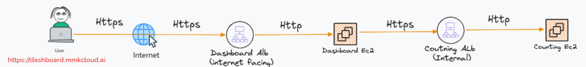

# CIE Lab 5 — Custom DNS and HTTPS for a Multi-AZ AWS Application

This lab upgrades an existing Dashboard and Counting application with **Route 53 private DNS**, **OpenSSL-issued certificates**, and **HTTPS listeners on Application Load Balancers**.

## Architecture

Application instances run in private subnets across multiple Availability Zones, managed by Auto Scaling Groups and Launch Templates.

## Lab Objectives

- Configure private DNS names for both services using Route 53 Alias records.
- Create an OpenSSL root CA and issue separate Dashboard and Counting certificates.
- Import server certificates into AWS Certificate Manager (ACM) and attach them to ALB HTTPS listeners.
- Configure client trust and verify certificate chains and hostnames.
- Redirect Dashboard HTTP requests to HTTPS and restrict service access using security groups.
- Include CA trust configuration in the AMI or user data so replacement instances retain it.

## Key Concepts

**AWS:** VPC, private subnets, Multi-AZ, ALB, target groups, Auto Scaling, Launch Templates, Route 53 and ACM.

**Security:** PKI, root CA, private keys, CSRs, server certificates, SANs, trust stores and TLS termination.

## Validation

- Confirm private DNS resolution from inside the VPC.
- Test Counting HTTPS from Dashboard EC2 using `curl --cacert`, then the configured trust store.
- Verify the Dashboard loads over HTTPS and retrieves Counting data.
- Check HTTP-to-HTTPS redirection and target health.

## Design Notes

- This lab uses an **OpenSSL private CA**, not the AWS Private CA service.
- Private DNS records require access to the VPC resolver or a temporary local mapping for browser testing.
- Clients must explicitly trust the lab root CA. Importing certificates into ACM does not establish browser trust.
- TLS terminates at each ALB; **ALB-to-EC2 traffic remains HTTP**.
- The first HTTP request before a redirect is unencrypted. Imported ACM certificates require renewal by the operator.
