# Lab 5A — OpenSSL and Self-Signed HTTPS

## Existing Infrastructure

- Dashboard and Counting services run in private subnets.
- Both services use ALB, ASG and Launch Templates.
- Dashboard ALB is internet-facing.
- Counting ALB is internal.
- Route 53 is not configured.
- Target groups currently forward HTTP traffic to EC2.

## Lab Goal

Configure Route 53 DNS and use OpenSSL-issued certificates so users access the Dashboard through HTTPS and the Dashboard securely calls the Counting ALB through HTTPS.

## Objectives

- Understand private keys, public keys, CSR, and certificates.
- Generate an RSA private key.
- Create a self-signed certificate with SAN.
- Inspect certificate information.
- Run a temporary HTTPS server.
- Test trusted and untrusted HTTPS with `curl`.

# Over Design Flow


# Security Group Design

| Security group | Mandatory inbound rule |
|---|---|
| Dashboard ALB SG | TCP `443` from users |
| Dashboard ALB SG | TCP `80` from users for HTTPS redirect |
| Dashboard EC2 SG | TCP `9000` from Dashboard ALB SG |
| Counting ALB SG | TCP `443` from Dashboard EC2 SG |
| Counting EC2 SG | TCP `8000` from Counting ALB SG |


# Implementation
## Create OpenSSL Root CA

# Step 1 Create Open SSL Root CA

1. Check openssl version

```bash
openssl version
```
2. Create the certificate workspace

```bash
mkdir -p ~/lab-5-openssl/{private,certs,csr}
cd ~/lab-5-openssl
```
3. Protect newly created files;
```bash
umask 077
```
4. Generate the encrypted Root CA private key

```bash
openssl genpkey -algorithm RSA -aes-256-cbc -pkeyopt rsa_keygen_bits:4096 -out private/mmkcloud-root-ca.key
```
Enter and safely record the private-key password.

5. Set Permission
```bash
chmod 600 private/mmkcloud-root-ca.key
```
6. Create Root CA Certificat
```bash
openssl req \
  -x509 \
  -new \
  -sha256 \
  -days 3650 \
  -key private/mmkcloud-root-ca.key \
  -out certs/mmkcloud-root-ca.crt \
  -subj "/C=MY/O=MMK Cloud /CN=MMK Cloud Root CA" \
  -addext "basicConstraints=critical,CA:TRUE,pathlen:0" \
  -addext "keyUsage=critical,keyCertSign,cRLSign"

  ```
  A CA certificate must contain basicConstraints=CA:TRUE; pathlen:0 prevents this Root CA from creating subordinate CAs.

  Set permission:
  ```bash
  chmod 644 certs/mmkcloud-root-ca.crt
  ```

7. Inspect the Root CA
```bash
openssl x509 \
  -in certs/mmkcloud-root-ca.crt \
  -noout \
  -subject \
  -issuer \
  -serial \
  -dates
  ```
  The subject and issuer should be identical because this is a self-signed Root CA

8. Check CA Extensions
```bash
openssl x509 \
  -in certs/mmkcloud-root-ca.crt \
  -noout \
  -text |
grep -A8 "X509v3 Basic Constraints"
```
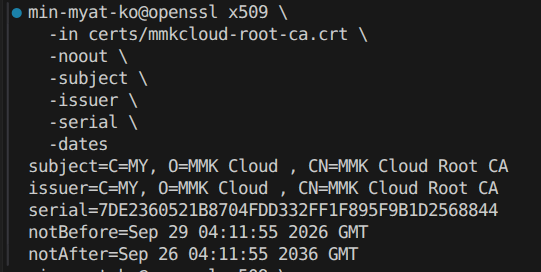

9. Verify the Root CA

```bash
openssl verify \
  -CAfile certs/mmkcloud-root-ca.crt \
  certs/mmkcloud-root-ca.crt
```
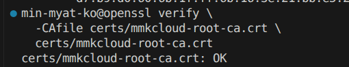

# Step 2 Issue the Dashboard Certificate

1. Generate the Dashboard private key
```bash
openssl genpkey \
  -algorithm RSA \
  -pkeyopt rsa_keygen_bits:2048 \
  -out private/dashboard.mmkcloud.ai.key
```
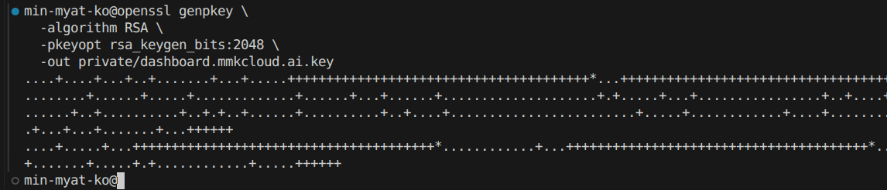

2. Set Permission
```bash
chmod 600 private/dashboard.mmkcloud.ai.key
```
3. Generte the dashboard CSR
```bash
openssl req \
  -new \
  -sha256 \
  -key private/dashboard.mmkcloud.ai.key \
  -out csr/dashboard.mmkcloud.ai.csr \
  -subj "/C=MY/O=MMK Cloud Lab/CN=dashboard.mmkcloud.ai"
```
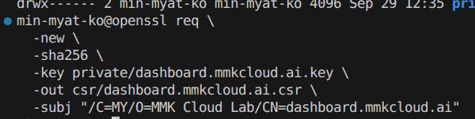

4. Create Certificatoin Extension File

```bash
nano dashboard-ext.cnf
```
Add:
```
basicConstraints=critical,CA:FALSE
keyUsage=critical,digitalSignature,keyEncipherment
extendedKeyUsage=serverAuth
subjectAltName=DNS:dashboard.mmkcloud.ai
subjectKeyIdentifier=hash
authorityKeyIdentifier=keyid,issuer
```

5. Sign the certificate with the Root CA
```bash
openssl x509 \
  -req \
  -sha256 \
  -days 365 \
  -in csr/dashboard.mmkcloud.ai.csr \
  -CA certs/mmkcloud-root-ca.crt \
  -CAkey private/mmkcloud-root-ca.key \
  -CAcreateserial \
  -out certs/dashboard.mmkcloud.ai.crt \
  -extfile dashboard-ext.cnf
```
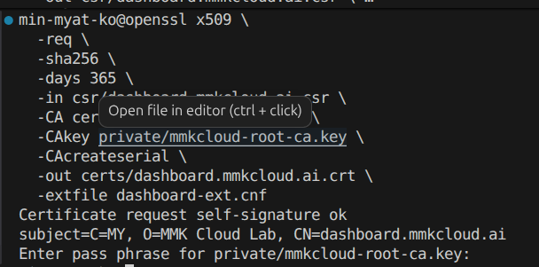

6. Inspect the dashboard certificate

```bash
openssl x509 \
  -in certs/dashboard.mmkcloud.ai.crt \
  -noout \
  -subject \
  -issuer \
  -serial \
  -dates \
  -ext subjectAltName
```
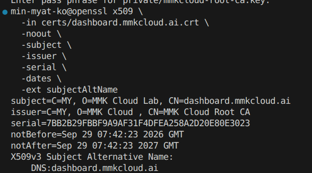

7. Verify the certificate chain

```bash
openssl verify \
  -CAfile certs/mmkcloud-root-ca.crt \
  certs/dashboard.mmkcloud.ai.crt
```
![verify-dashboard-crt-chain](../evidence/verify-dashboard-crt-chain.png

# Step 3: Issue the Counting Certificate
Create a certificate for:counting.mmkcloud.ai

1. Generate the private key
```bash
cd ~/lab-5-openssl
openssl genpkey \
  -algorithm RSA \
  -pkeyopt rsa_keygen_bits:2048 \
  -out private/counting.mmkcloud.ai.key

chmod 600 private/counting.mmkcloud.ai.key
```

2. Generate the CSR
```bash
openssl req \
  -new \
  -sha256 \
  -key private/counting.mmkcloud.ai.key \
  -out csr/counting.mmkcloud.ai.csr \
  -subj "/C=MY/O=MMK Cloud Lab/CN=counting.mmkcloud.ai"
```

3. Create the extension file
```bash
nano counting-ext.cnf

Add:
basicConstraints=critical,CA:FALSE
keyUsage=critical,digitalSignature,keyEncipherment
extendedKeyUsage=serverAuth
subjectAltName=DNS:counting.mmkcloud.ai
subjectKeyIdentifier=hash
authorityKeyIdentifier=keyid,issuer
```

4. Sign the certificate
```bash
openssl x509 \
  -req \
  -sha256 \
  -days 365 \
  -in csr/counting.mmkcloud.ai.csr \
  -CA certs/mmkcloud-root-ca.crt \
  -CAkey private/mmkcloud-root-ca.key \
  -CAserial certs/mmkcloud-root-ca.srl \
  -out certs/counting.mmkcloud.ai.crt \
  -extfile counting-ext.cnf
```

Enter the Root CA private-key password.

5. Inspect the certificate
```bash
openssl x509 \
  -in certs/counting.mmkcloud.ai.crt \
  -noout \
  -subject \
  -issuer \
  -dates \
  -ext subjectAltName
```
Expected SAN:
DNS:counting.mmkcloud.ai

6. Verify the chain and hostname
```bash
openssl verify \
  -CAfile certs/mmkcloud-root-ca.crt \
  -verify_hostname counting.mmkcloud.ai \
  certs/counting.mmkcloud.ai.crt
```

Expected:
certs/counting.mmkcloud.ai.crt: OK

Files for ACM:
Certificate:  certs/counting.mmkcloud.ai.crt
Private key:  private/counting.mmkcloud.ai.key
Chain:        certs/mmkcloud-root-ca.crt

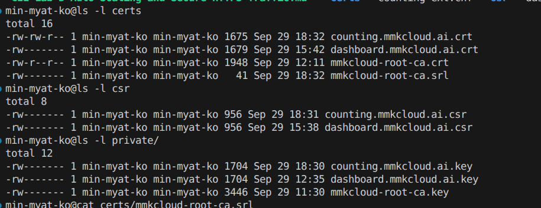

# Step 5: Create the private hosted zone
In the AWS console:
1. Open VPC → Your VPCs, select your lab VPC, and check that DNS resolution and DNS hostnames are enabled.
2. Open Route 53 → Hosted zones → Create hosted zone.
3. Enter mmkcloud.ai.
4. Choose Private hosted zone.
5. Associate your lab VPC in ap-southeast-1, then create the zone

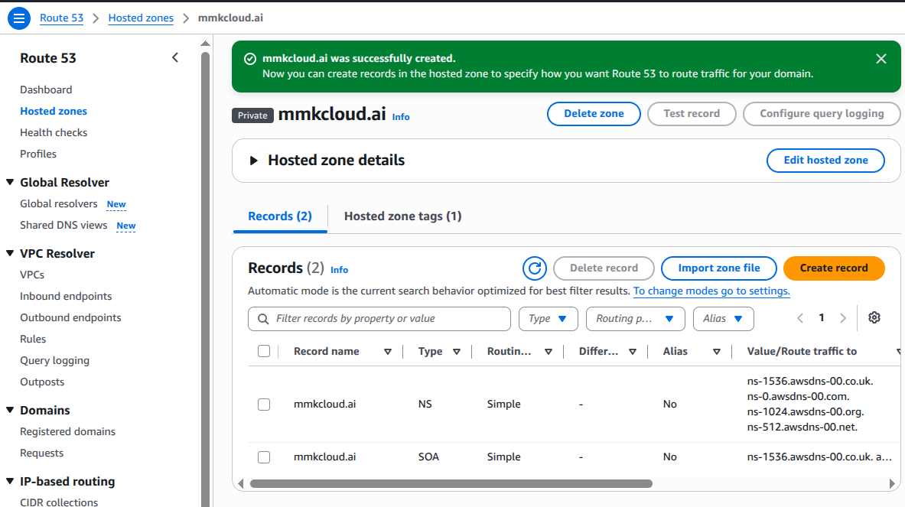

## Create the two DNS records
Inside the mmkcloud.ai private hosted zone, create these A records with Alias enabled:
Record name	Alias target
dashboard	Your dashboard ALB
counting	Your internal counting ALB
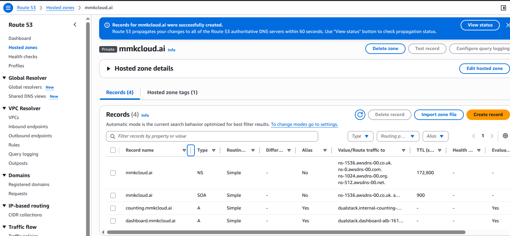

For each record, choose Alias to Application and Classic Load Balancer, select ap-southeast-1, and select the correct ALB. The resulting names are dashboard.mmkcloud.ai and counting.mmkcloud.ai

# Step 6: Import both server certificates into ACM

Open AWS Certificate Manager in ap-southeast-1 and import each certificate separately:
| ACM field | Dashboard import | Counting import |
|---|---|---|
| Certificate body | `dashboard.mmkcloud.ai.crt` | `counting.mmkcloud.ai.crt` |
| Certificate private key | Matching dashboard `.key` | Matching counting `.key` |
| Certificate chain | Your **root CA certificate** | Your **root CA certificate** |

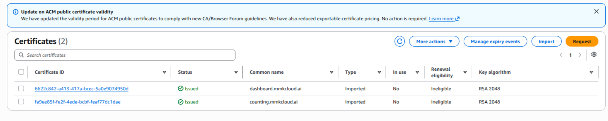

# Step 4: Import Dashboard Certificate into ACM (Through CLI) Alternative way to import crt
Import into the same Region as the Dashboard ALB:
ap-southeast-1

1. Verify AWS CLI access
```bash
aws sts get-caller-identity
```
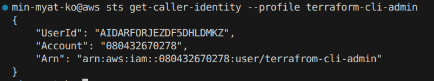

2. Import the certificate
```bash
cd ~/lab-5-openssl
aws acm import-certificate \
  --certificate fileb://certs/dashboard.mmkcloud.ai.crt \
  --private-key fileb://private/dashboard.mmkcloud.ai.key \
  --certificate-chain fileb://certs/mmkcloud-root-ca.crt \
  --region ap-southeast-1 \
  --query CertificateArn \
  --output text
```

The command returns an ARN:
arn:aws:acm:ap-southeast-1:ACCOUNT-ID:certificate/CERTIFICATE-ID

Save this as the Dashboard certificate ARN.
ACM requires the certificate, unencrypted private key and optional chain as separate PEM-encoded inputs. Amazon.com

3. Verify in ACM
Open: AWS Console → Certificate Manager → Region: Asia Pacific (Singapore)

Confirm:
Property	Expected value
Domain	dashboard.mmkcloud.ai
Status	Issued
Type	Imported
In use	No


In use: No is expected because it has not yet been attached to the Dashboard ALB.
Important
Imported ACM certificates do not receive automatic managed renewal. You must issue and reimport a new certificate before expiration.Step 4: Import Dashboard Certificate into ACM
Import into the same Region as the Dashboard ALB:
ap-southeast-1

# Step 5. Add HTTPS to both ALBs

1. Do this for each ALB under 
  In EC2 → Load Balancers → Listeners and rules → Add listener:
  ALB	Listener	ACM certificate	Forward to
  Dashboard ALB	HTTPS 443	dashboard.mmkcloud.ai	Existing dashboard target group
Internal counting ALB	HTTPS 443	counting.mmkcloud.ai	Existing counting target group

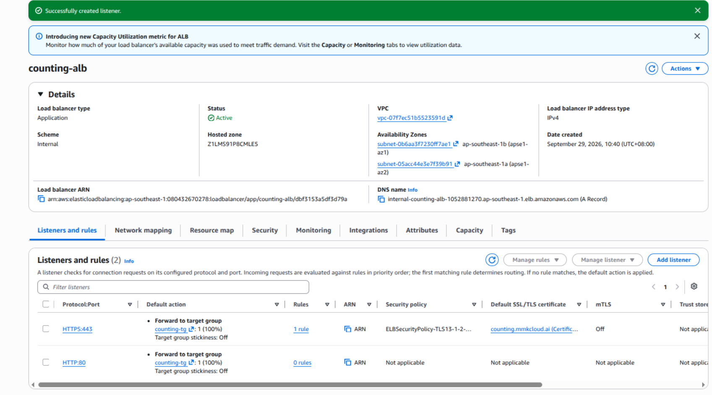
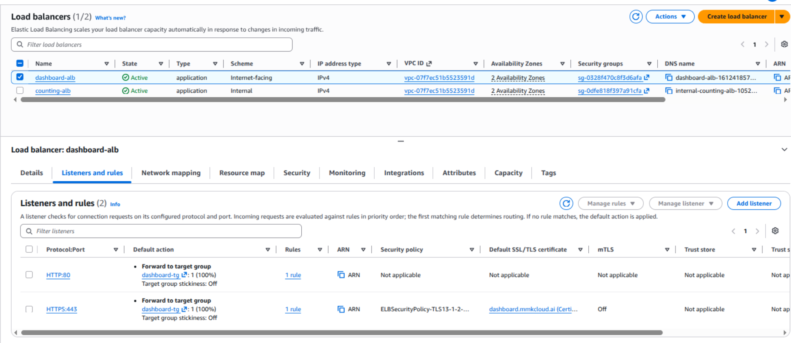

Keep the target groups on their current HTTP application ports. 
An HTTPS listener can forward to an HTTP target group;

Check security groups:
- Dashboard ALB: allow inbound 443 from the clients permitted to use it.
- Counting ALB: allow inbound 443 from the dashboard EC2 security group and from any in-VPC test client you intend to use.
- EC2 instances: continue allowing their application ports from their respective ALB security groups.

# Step 6. Test counting HTTPS from inside the VPC

1. Copy the root CA certificate to the dashboard EC2 instance

```bash 
scp -i ~/.ssh/YOUR_EC2_KEY.pem \
  -o ProxyJump=ec2-user@BASTION_PUBLIC_IP \
  ~/lab-5-openssl/certs/mmkcloud-root-ca.crt \
  ec2-user@DASHBOARD_PRIVATE_IP:~/
```

On a dashboard EC2 instance, first test with the root CA file without changing system trust:
```bash
curl -v --cacert /path/to/mmkcloud-root-ca.crt \
  https://counting.mmkcloud.ai/
```
Expect to sucess:
.png)
```bash
curl -v https://coutning.mmkcloud.ai
```

Expect to fail:

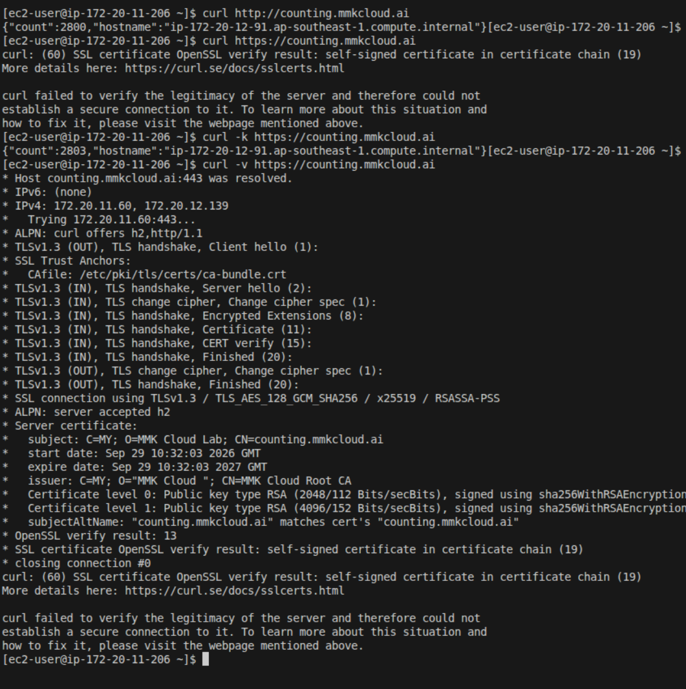

Use the counting service’s actual working path if / is not its endpoint. Do not use -k for the final test: --cacert lets curl verify both the certificate chain and the requested hostname. A successful response here proves that the dashboard instance can resolve the private name, reach the counting ALB on 443, and trust its certificate.

## Install the root CA certificate only into the dashboard EC2 trust store
```bash
sudo cp mmkcloud-root-ca.crt /etc/pki/ca-trust/source/anchors/mmkcloud-root-ca.crt
sudo chmod 644 /etc/pki/ca-trust/source/anchors/mmkcloud-root-ca.crt
curl -v https://counting.mmkcloud.ai/
```

Because your dashboard runs in an ASG, put this trust-store installation into its launch template user data or AMI, then refresh the dashboard instances. Otherwise replacement instances will lose that trust configuration. 
Never copy the root CA private key to EC2.
