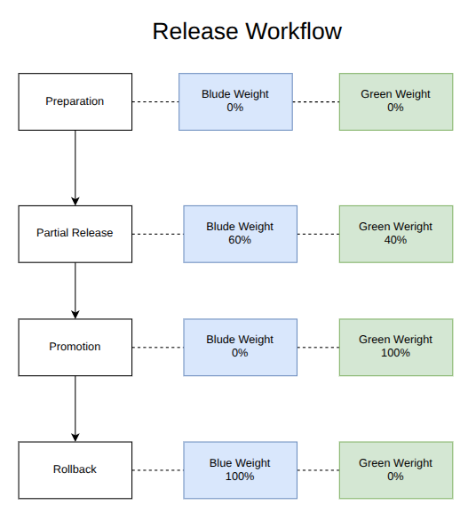

# 1. Blue-Green Deployment

**Scope**

Deploy two Dashboard versions—Blue and Green—using separate Launch Templates, ASGs, and target groups. 
Each environment runs two EC2 instances across two Availability Zones. 

**Objectives**

- Prepare Green Development while Blue continues serving traffic.
- Route approximately **60% of requests to Blue and 40% to Green**.
- Validate Green before promoting it to 100% traffic.
- Test rollback to Blue by changing ALB weights.

# 2. Blue–Green Deployment and Canary Rollout

**Blue–green structure**

I maintain two Dashboard environments:

| Resource | Blue | Green |
|---|---|---|
| Application | Existing version | Updated version |
| Launch Template | Blue configuration | Green configuration |
| ASG | Two EC2 instances across two AZs | Two EC2 instances across two AZs |
| Target group | `dashboard-tg` | `dashboard-green-tg` |

Both environments share the **Dashboard ALB** and **Counting service**. I isolate the Dashboard release while retaining its existing backend dependency.

**Canary rollout theory**

Blue–green describes the **two environments**. 
Canary rollout describes **gradually exposing the new version to live traffic**.

I combine these approaches by configuring weighted ALB forwarding. Instead of immediately replacing Blue, I send approximately **40% of requests to Green** and observe its behavior before promotion.

**Release workflow**

A **zero weight** prevents ordinary weighted traffic from selecting Green; it does not stop Green’s instances or its health checks.

**Real-world example**
Introduce an updated shopping Dashboard, Blue displays the existing interface, while Green displays the new interface. Both use the same backend API. I compare errors and latency before directing all traffic to Green.

**Key principle**

The **60/40 split controls requests**, while the **ASGs control capacity**. Two instances in each environment can still receive different traffic shares. Configuring these weights alone does not prove that distribution or performance tests passed.

# 3. Environment Isolation and Reproducible Deployment

Keep Blue and Green in separate **Launch Templates, ASGs, and target groups**. This allows  to prepare Green without replacing the running Blue instances.

**Environment isolation**

| Separate resource | Purpose |
|---|---|
| **Launch Template** | Defines each version’s EC2 launch configuration |
| **ASG** | Maintains each environment’s instances independently |
| **Target group** | Separates the destinations for traffic routing and health checks |

Both environments share the VPC, Dashboard ALB, and Counting service. This provides **Dashboard deployment isolation**, while shared infrastructure and backend failures can still affect both environments.

**Launch Template**

A Launch Template defines the configuration used when launching EC2 instances, including:

- **AMI:** Operating system and preinstalled software.
- **Instance type:** Compute and memory capacity.
- **Security groups:** Network access rules.
- **IAM instance profile:** AWS permissions available to the instance.
- **User Data:** Startup configuration, such as installing Dashboard, configuring CA trust, and creating its systemd service. 

**Reproducible deployment**

I configure each ASG to use a **specific Launch Template version** and a **fixed application release**. Replacement instances can then follow the same deployment configuration.

**Real-world example**

I deploy Dashboard v2 on new Green instances while Dashboard v1 remains available on Blue. If v2 fails validation, I retain Blue and correct Green’s configuration before trying again.

# 4. Shared Counting Service and Version Compatibility

I connect both Dashboard versions to the **same Counting service through its internal HTTPS ALB**. My deployment changes the Dashboard tier while retaining the existing backend.

**Version compatibility**

An **API contract** defines how services communicate: the endpoint, request format, response fields, data types, and expected behavior.

I ensure both Blue and Green understand Counting’s existing API contract.

| Requirement | What I verify |
|---|---|
| **Endpoint** | Both versions use the correct Counting HTTPS URL. |
| **Response format** | Both correctly interpret Counting’s response. |
| **TLS trust** | Both trust the CA that issued Counting’s certificate. |
| **Network access** | Both can reach the internal Counting ALB on port 443. |
| **Error handling** | Both handle failed or slow Counting requests appropriately. |

I preserve the existing contract during the rollout. The same compatibility principle applies to shared databases: changes must allow the old application to continue operating during release and rollback. 

**Verification workflow**

1. Verify Counting connectivity from both environments.
2. Confirm HTTPS certificate validation succeeds.
3. Confirm both Dashboards display a valid Counting result.
4. Check application logs for backend errors before increasing Green traffic.

A healthy Dashboard target alone does not prove that its Counting integration works.

**Shared dependency and rollback**

If Counting fails, **both Dashboard versions may be affected**. Returning traffic to Blue fixes a Green-specific problem only when Blue and its dependencies still work.

**Real-world example**

Releasing a new shopping interface while both interfaces use the same inventory API. It must preserve inventory compatibility so customers can browse products through either version.

# t. ALB Weighted Routing and Traffic Distribution

I configure the Dashboard ALB’s **HTTPS:443 listener** to forward requests to two target groups:

| Environment | Target group | Weight | Expected request share |
|---|---|---:|---:|
| Blue | `dashboard-tg` | 60 | 60% |
| Green | `dashboard-green-tg` | 40 | 40% |

**Request workflow**

1. The ALB receives a request through its HTTPS listener.
2. The matching listener rule selects Blue or Green using the configured weights.
3. The ALB selects a target within that group using its routing algorithm.
4. The selected Dashboard instance processes the request and returns a response.

I disable stickiness during distribution testing so returning clients are not kept on a previously selected environment.

# 6. Traffic Weights versus Instance Capacity

I manage **traffic distribution through ALB weights** and **compute capacity through ASGs**. These settings operate independently.

| Setting | Controls | My lab |
|---|---|---|
| **ALB weights** | Request share between environments | Blue 60 / Green 40 |
| **ASG desired capacity** | Number of instances maintained | Two per environment |
| **ASG minimum and maximum** | Allowed instance-count range | Minimum 2 / maximum 2 |

With **minimum, desired, and maximum all set to 2**, each ASG maintains two instances and cannot scale out beyond two.

**Capacity example**

Assuming 1,000 requests and approximately even distribution within each target group:

| Environment | Requests | Instances | Approximate requests per instance |
|---|---:|---:|---:|
| Blue | 600 | 2 | 300 |
| Green | 400 | 2 | 200 |

If I increase Green’s capacity to **three instances**, its share remains approximately **400 requests**, now spread across three instances. Adding instances does not change the ALB’s 60/40 weights. 

**Request count is not processing load**

A request may require different amounts of CPU, memory, or backend work. Green can receive fewer requests yet consume more resources if its updated code is slower.

I therefore assess capacity using **latency, errors, CPU utilization, and backend performance**, alongside request counts.

**Full-release requirement**

Before promoting Green from **40% to 100%**, verify that it can handle the full workload. At unchanged total traffic, this increases Green’s request volume by approximately **2.5 times**.

**Real-world example**

Introducinga new checkout version that performs additional validation. Even with fewer requests, it may need more instances because each checkout takes longer to process

# 7.Session Stickiness and Traffic Distribution

usee **stickiness** when a browser needs to remain on the same Dashboard version or EC2 instance across multiple requests.

| Type | Keeps requests on | Configured at |
|---|---|---|
| **Target group stickiness** | The same Blue or Green environment | Listener’s forwarding action |
| **Target stickiness** | The same EC2 instance within an environment | Target group attributes |

**How it works**

1. A browser sends a request without a stickiness cookie.
2. The ALB selects Blue or Green using the **60/40 weights**.
3. With target group stickiness enabled, the ALB returns an **`AWSALBTG` cookie** identifying that environment.
4. The browser sends the cookie with subsequent requests.
5. The ALB keeps those requests on the selected environment for the configured duration.

**Effect on traffic distribution**

Without stickiness, requests can alternate between Blue and Green.

With stickiness, returning browsers remain assigned to an environment. A highly active Green browser may generate many requests, so the overall request totals can differ from 60/40.

**My lab configuration**

I disable **both types of stickiness** during traffic-distribution testing. This allows me to evaluate weighted routing without cookie-based assignments affecting the results.

**Real-world example**

For a shopping application, I keep a customer on the same checkout version throughout their purchase. However, stickiness does not synchronize session data or guarantee that the assigned instance remains available.

# 8. Traffic Distribution and Performance Testing

I test two separate questions: **Did requests follow the configured weights?** and **Did the application perform acceptably?**

| Test | Purpose |
|---|---|
| **Distribution test** | Measure the actual Blue/Green request share |
| **Performance test** | Measure latency, throughput, errors, and resource usage under load |

**Traffic-distribution measurement**

I compare CloudWatch **`RequestCount`**, using **`Sum`** with the **LoadBalancer and TargetGroup dimensions**, for Blue and Green over the same time window. This measures requests for which the ALB selected a target; it does not prove successful application responses. 

I use target-group metrics because I have not classified responses using Blue/Green version markers.

**Reliable test workflow**

1. Confirm the actual listener rule and weights.
2. Disable both stickiness settings.
3. Confirm the test script preserves the intended weights—particularly when testing **0/100**.
4. Record the start time and generate requests.
5. Record the end time and allow metrics to become available.
6. Compare both target groups within that isolated window.

I exclude earlier traffic where possible. A window containing both **60/40 testing and 100% Green testing** can show a mixed result.

**Performance measurement**

| Measurement | What I assess |
|---|---|
| **Client latency** | Total time observed by the load generator |
| **`TargetResponseTime`** | Time from ALB forwarding until response headers begin |
| **p95 latency** | Response time at or below which 95% of measurements fall |
| **Throughput** | Completed requests per second |
| **Errors** | Client failures, ALB errors, and target errors |
| **CPU and healthy targets** | Capacity pressure and availability |

CloudWatch supports average and percentile statistics for `TargetResponseTime`; this metric is not the complete browser response time.
**Real-world example**

Green receives the expected 40% share but responds slowly during concurrent checkout requests. Routing works correctly, yet Green still requires investigation before promotion.

I record measured results before declaring either test successful.

# 9. Release Criteria and Full Green Promotion

I promote Green only after evidence shows that it works correctly and can handle the full workload.

**Release criteria**

| Criterion | Required evidence |
|---|---|
| **Healthy targets** | Both Green instances remain healthy |
| **Functional correctness** | Green displays valid Counting data over trusted HTTPS |
| **Traffic distribution** | Measured request share approximately matches 60/40 |
| **Errors and latency** | Results meet thresholds defined before testing |
| **Full-load capacity** | Green and shared Counting can support the expected workload |
| **Rollback readiness** | Blue remains healthy and compatible |

A successful **40% traffic test** alone does not establish readiness for **100% traffic**.

**Promotion theory**

I change the production forwarding weights to:

| Environment | Before | After |
|---|---:|---:|
| Blue | 60 | 0 |
| Green | 40 | 100 |

The ALB directs newly selected requests to Green. Changing weights does not terminate Blue instances or cancel requests already being processed. Stickiness can affect the transition, so I keep it disabled for this lab.

# 10. Rollback to Blue

I roll back by returning production traffic to the **known working Blue version** when Green fails release criteria.

**Rollback triggers**

- Errors exceed the defined threshold.
- Response times become unacceptable.
- Dashboard displays incorrect or missing Counting data.
- Green becomes unstable under load.

**Routing change**

| Environment | Promoted state | Rollback state |
|---|---:|---:|
| Blue | 0 | 100 |
| Green | 100 | 0 |

I change the ALB forwarding weights instead of reinstalling the old application. Keeping Blue available enables a faster recovery. [aws.amazon.com](https://aws.amazon.com/blogs/devops/blue-green-deployments-with-application-load-balancer/?utm_source=chatgpt.com)

**Rollback workflow**

1. Confirm Blue is healthy and has sufficient capacity.
2. Set **Blue 100 / Green 0** on the production listener rule.
3. Verify the applied weights and ensure test scripts preserve them.
4. Confirm fresh requests reach Blue.
5. Check Dashboard functionality, errors, and latency.
6. Preserve Green’s logs and configuration for investigation.

**Rollback limitations**

Changing weights affects new routing decisions. It does not cancel requests already running or undo changes Green made to shared data.

Rollback also depends on **Blue remaining compatible with Counting**. If the shared Counting service fails, switching Dashboard traffic to Blue may not restore service. Shared data changes must preserve compatibility with the old version.

**Real-world example**

The updated shopping Dashboard introduces checkout errors. I return traffic to Blue, verify that checkout works again, and investigate Green separately.

**Key principle**

Rollback is successful when service behavior recovers—not merely when the weights show **100/0**.

# 11. End-to-End Deployment Workflow

I separate preparation, validation, traffic shifting, and cleanup so each release decision is supported by evidence.

| Stage | My action | Required outcome |
|---|---|---|
| **Baseline** | Record Blue’s configuration and behavior | Known working version |
| **Prepare** | Deploy Green with zero production weight | New version available for testing |
| **Verify** | Check health, HTTPS trust, and Counting integration | Green functions correctly |
| **Share traffic** | Configure Blue 60 / Green 40 | Partial live exposure |
| **Measure** | Compare request counts, errors, latency, and capacity | Release criteria satisfied |
| **Promote** | Configure Blue 0 / Green 100 | Green serves production traffic |
| **Observe** | Monitor Green while retaining Blue | Stable operation under full traffic |
| **Clean up** | Retire Blue after the rollback period | Lower cost |
| **Rollback when needed** | Configure Blue 100 / Green 0 | Verify service recovery |

**Three separate forms of evidence**

- **Configuration:** The listener shows the intended weights.
- **Routing:** Measurements show where requests actually went.
- **Application behavior:** Users receive correct responses within acceptable performance limits.

I do not treat one as proof of the others. A **60/40 configuration** does not prove a measured 60/40 split, and correct routing does not prove that Counting integration works.

**Real-world example**

I release an updated shopping Dashboard, expose it to part of the traffic, and measure its behavior. I promote it after validation, retain the previous version for recovery, and remove the old resources after the observation period.

