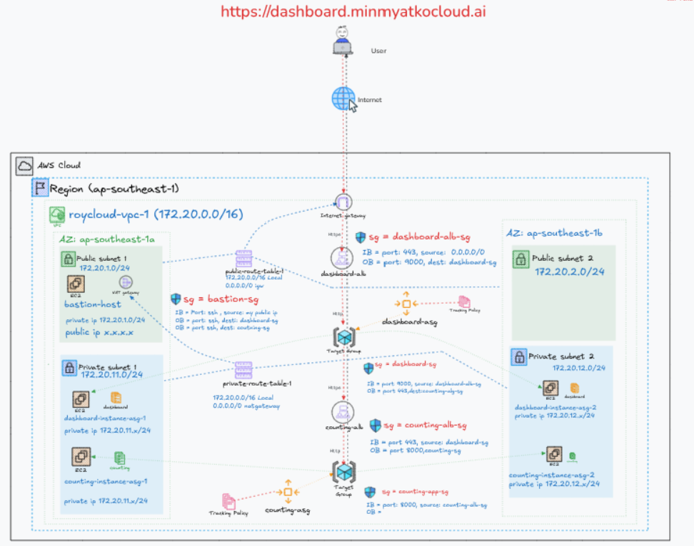
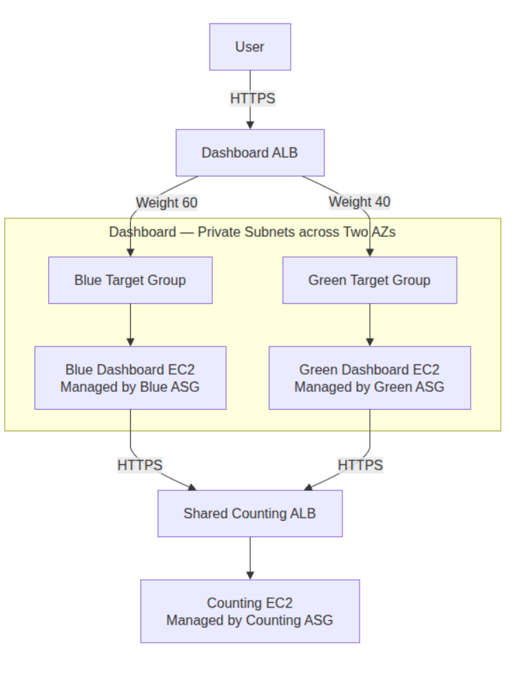

# 1. Planning
Scope
Upgrade the Dashboard tier of Lab-4. Both versions share the existing Counting service.
Objectives
- Keep the existing Dashboard as Blue.
- Deploy the updated Dashboard as Green.
- Route approximately 60% of requests to Blue and 40% to Green.
- Validate traffic distribution and application performance.
- Demonstrate 100% Green release and 100% Blue rollback.
Requirements
- Working Lab-4 environment.
- Separate Green Launch Template, ASG, and target group.
- Existing Dashboard ALB, DNS, and HTTPS.
- Identifiable Blue and Green responses or logs.
- Green compatibility with Counting.
- Defined error and response-time thresholds.

# 2. Design
Retain Blue and deploy Green in the existing private subnets across two Availability Zones. Both versions use the shared Counting service.

| Resource | Blue — Existing | Green — New |
|---|---|---|
| Launch Template | Existing Dashboard template | Green Dashboard template |
| ASG | Existing Dashboard ASG | Green Dashboard ASG |
| Target group | Blue Dashboard targets | Green Dashboard targets |
| Application | Existing version | Updated version |
| ALB traffic weight | 60 | 40 |

## Existing Architecture Diagram




## Architecture Diagram: Reqeust Workflow



Design rules
- Register each Dashboard ASG with its own target group.
- Allow Dashboard application traffic only from the Dashboard ALB security group.
- Allow both Dashboard environments to reach the Counting ALB.
- Preserve DNS, certificate trust, and HTTP-to-HTTPS redirection.
- Disable target-group stickiness for traffic-distribution testing.
- Keep Blue available during Green validation and release.

Routing states

| State | Blue weight | Green weight |
|---|---:|---:|
| Before validation | 100 | 0 |
| Traffic sharing | 60 | 40 |
| Full release | 0 | 100 |
| Rollback | 100 | 0 |


# 3. Implementation — Step 1: Record the Blue Environment
Goal: Identify the existing Dashboard resources before creating Green.

In the AWS Console, select the region containing Lab-4 and record:

| Resource | Record |
|---|---|
| Dashboard ALB | Name |
| HTTPS listener | Port and current forwarding target group |
| Dashboard target group | Name, application port, health-check path |
| Dashboard ASG | Name, minimum, desired, and maximum capacity |
| Launch Template | Name and version used by the ASG |
| Network | VPC, private subnet IDs, and security group IDs |
| Counting endpoint | HTTPS URL configured in Dashboard |

#### Baseline Checklist

-[]Dashboard opens successfully over HTTPS.
-[]Dashboard displays a valid Counting response.
-[]Existing Dashboard targets are healthy.
-[]Save the Launch Template’s User Data for the Green configuration.

Result: The existing Dashboard ASG and target group are identified as Blue. Keep their current names and configuration.

## Implementation — Step 2: Create the Green Target Group

1. Open EC2 → Target Groups → Create target group.
2. Configure:

```text
Setting	Value
Target type	Instances
Target group name	dashboard-green-tg
Protocol	HTTP
Port	Same application port recorded for Blue
IP address type	Same as Blue
VPC	Existing vpc-01-roycloud
Protocol version	Same as Blue
```
3. Copy Blue’s health-check settings: protocol, port, path, success codes, thresholds, interval, and timeout.
4. Click Next.
5. Leave target registration empty.
6. Click Create target group. AWS permits creating a target group without registering targets. 

Elastic Load Balancing
Verification
- [ ] dashboard-green-tg exists in the correct VPC.
- [ ] Application port and health-check settings match Blue.

## Implementation — Step 3: Prepare the Green Launch Template

1. Open EC2 → Launch Templates → Create launch template.
2. Enter:
   - Name: dashboard-green-lt
   - Version description: Green Dashboard configuration
3. Expand Source template.
4. Select Blue’s Launch Template and the exact version used by Blue’s ASG. AWS supports creating a separate template from an existing version. Amazon Elastic Compute Cloud
5. Review the configuration:
Setting	Green configuration
AMI, instance type, storage	Retain Blue’s settings
Key pair, IAM instance profile	Retain Blue’s settings
Security groups	Existing Dashboard security groups
Subnet	Leave unspecified; select private subnets in the ASG
Public IPv4	Disabled
Instance resource tags	Name=dashboard-green, Environment=Green


6. Under Advanced details → User data, prepare the Green application change while preserving:
   - Dashboard application port.
   - Shared Counting HTTPS endpoint.
   - CA trust configuration.
   - Dedicated service user and systemd setup.

```bash
#!/bin/bash
exec > /var/log/user-data.log 2>&1
set -e

APP_URL="https://github.com/hashicorp/demo-consul-101/releases/download/v0.0.5/dashboard-service_linux_amd64.zip"
COUNTING_URL="https://YOUR_COUNTING_CERTIFICATE_HOSTNAME"

# Install required packages
dnf update -y
dnf install -y unzip ca-certificates

# Install the root CA certificate
cat > /etc/pki/ca-trust/source/anchors/lab-root-ca.crt <<'CAEOF'
-----BEGIN CERTIFICATE-----
PASTE_YOUR_ROOT_CA_CERTIFICATE_BODY_HERE
-----END CERTIFICATE-----
CAEOF

chmod 644 /etc/pki/ca-trust/source/anchors/lab-root-ca.crt
update-ca-trust extract

# Download and extract the application
cd /tmp
curl -fLO "$APP_URL"
unzip -o dashboard-service_linux_amd64.zip

# Create the dedicated group and user
getent group dashboard-user >/dev/null ||
    groupadd --system dashboard-user

id dashboard-user >/dev/null 2>&1 ||
    useradd --system \
        --gid dashboard-user \
        --no-create-home \
        --shell /usr/sbin/nologin \
        dashboard-user

# Create the application directory
mkdir -p /opt/dashboard-service

mv -f dashboard-service_linux_amd64 \
    /opt/dashboard-service/dashboard-service

chown -R dashboard-user:dashboard-user /opt/dashboard-service
chmod 750 /opt/dashboard-service/dashboard-service

# Create the systemd service
cat > /etc/systemd/system/dashboard-service.service <<EOF
[Unit]
Description=HashiCorp Demo Dashboard Service
After=network-online.target
Wants=network-online.target

[Service]
Type=simple
User=dashboard-user
Group=dashboard-user
WorkingDirectory=/opt/dashboard-service
Environment="PORT=9000"
Environment="COUNTING_SERVICE_URL=${COUNTING_URL}"
ExecStart=/opt/dashboard-service/dashboard-service
Restart=always
RestartSec=5

[Install]
WantedBy=multi-user.target
EOF

# Reload, enable and start the service
systemctl daemon-reload
systemctl restart dashboard-service.service
systemctl enable --now dashboard-service
```

