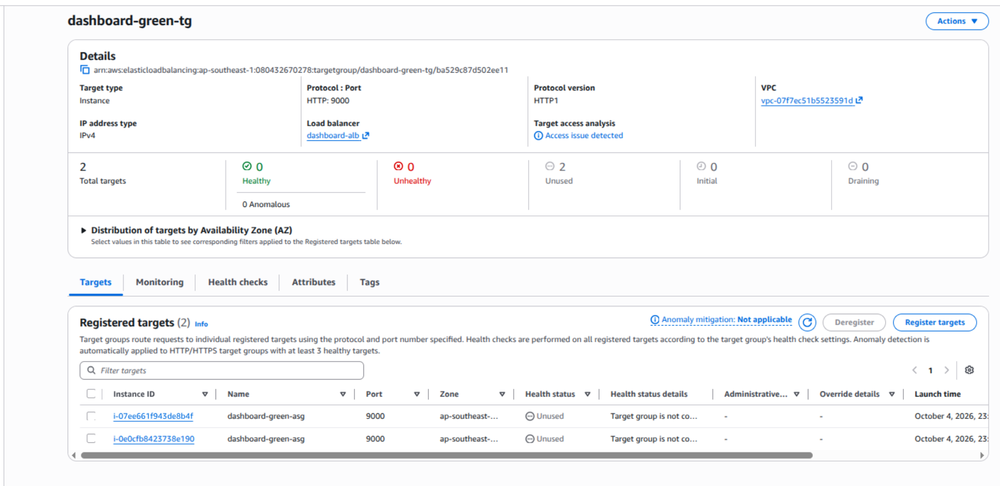
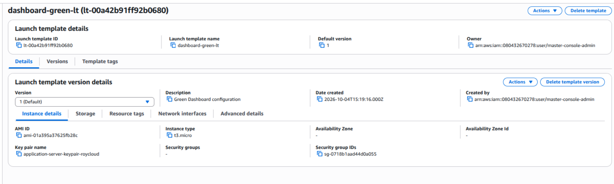
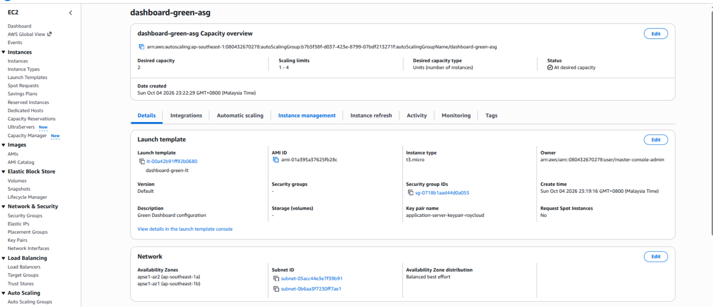
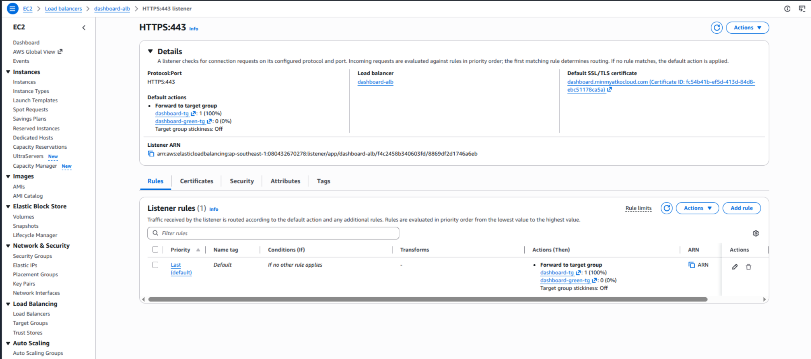
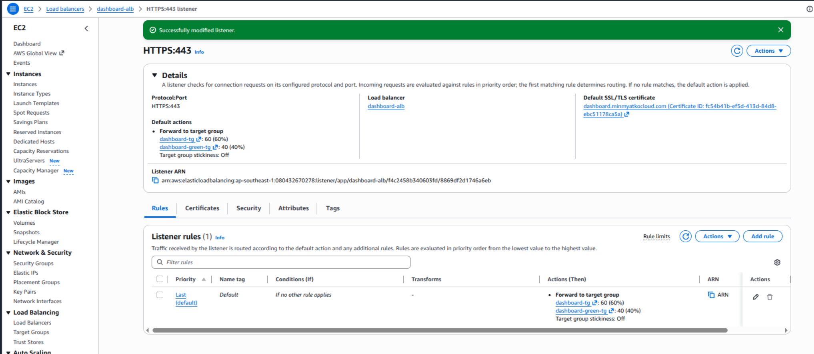
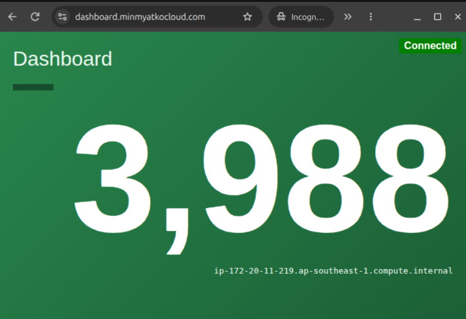

# 1. Planning
## Scope
Upgrade the Dashboard tier of Lab-4. Both versions share the existing Counting service.
Objectives
- Keep the existing Dashboard as Blue.
- Deploy the updated Dashboard as Green.
- Route approximately 60% of requests to Blue and 40% to Green.
- Validate traffic distribution and application performance.
- Demonstrate 100% Green release and 100% Blue rollback.
Requirements
- Working Lab-4 environment.
- Separate Green Launch Template, ASG, and target group.
- Existing Dashboard ALB, DNS, and HTTPS.
- Identifiable Blue and Green responses or logs.
- Green compatibility with Counting.
- Defined error and response-time thresholds.

# 2. Design
Retain Blue and deploy Green in the existing private subnets across two Availability Zones. Both versions use the shared Counting service.

| Resource | Blue — Existing | Green — New |
|---|---|---|
| Launch Template | Existing Dashboard template | Green Dashboard template |
| ASG | Existing Dashboard ASG | Green Dashboard ASG |
| Target group | Blue Dashboard targets | Green Dashboard targets |
| Application | Existing version | Updated version |
| ALB traffic weight | 60 | 40 |

## Existing Architecture Diagram


## Architecture Diagram: Reqeust Workflow


### Design rules
- Register each Dashboard ASG with its own target group.
- Allow Dashboard application traffic only from the Dashboard ALB security group.
- Allow both Dashboard environments to reach the Counting ALB.
- Preserve DNS, certificate trust, and HTTP-to-HTTPS redirection.
- Disable target-group stickiness for traffic-distribution testing.
- Keep Blue available during Green validation and release.

### Routing states

| State | Blue weight | Green weight |
|---|---:|---:|
| Before validation | 100 | 0 |
| Traffic sharing | 60 | 40 |
| Full release | 0 | 100 |
| Rollback | 100 | 0 |


# 3. Implementation — Step 1: Record the Blue Environment
Goal: Identify the existing Dashboard resources before creating Green.

In the AWS Console, select the region containing Lab-4 and record:

| Resource | Record |
|---|---|
| Dashboard ALB | Name |
| HTTPS listener | Port and current forwarding target group |
| Dashboard target group | Name, application port, health-check path |
| Dashboard ASG | Name, minimum, desired, and maximum capacity |
| Launch Template | Name and version used by the ASG |
| Network | VPC, private subnet IDs, and security group IDs |
| Counting endpoint | HTTPS URL configured in Dashboard |


Result: The existing Dashboard ASG and target group are identified as Blue. Keep their current names and configuration.

## Implementation — Step 2: Create the Green Target Group

1. Open EC2 → Target Groups → Create target group.
2. Configure:

```text
Setting	Value
Target type	Instances
Target group name	dashboard-green-tg
Protocol	HTTP
Port	Same application port recorded for Blue (9000)
IP address type	Same as Blue
VPC	Existing vpc-01-roycloud
Protocol version	Same as Blue
```
3. Copy Blue’s health-check settings: protocol, port, path, success codes, thresholds, interval, and timeout.
4. Click Next.
5. Leave target registration empty.
6. Click Create target group. 


## Implementation — Step 3: Prepare the Green Launch Template

1. Open EC2 → Launch Templates → Create launch template.
2. Enter:
   - Name: dashboard-green-lt
   - Version description: Green Dashboard configuration
3. Expand Source template.
4. Select Blue’s Launch Template and the exact version used by Blue’s ASG. AWS supports creating a separate template from an existing version. 
5. Review the configuration:
Setting	Green configuration
AMI, instance type, storage	Retain Blue’s settings
Key pair, IAM instance profile	Retain Blue’s settings
Security groups	Existing Dashboard security groups
Subnet	Leave unspecified; select private subnets in the ASG
Public IPv4	Disabled
Instance resource tags	Name=dashboard-green, Environment=Green



6. Under Advanced details → User data, prepare the Green application change while preserving:
   - Dashboard application port.
   - Shared Counting HTTPS endpoint.
   - CA trust configuration.
   - Dedicated service user and systemd setup.

# User Data of Green-Dashobard for dashboard server
```bash
#!/bin/bash
exec > /var/log/user-data.log 2>&1
set -e
APP_URL="https://github.com/minmyatko-cloud/cloud-infrastructure-portfolio/releases/download/dashboard-green-v1.0.0/dashboard-service_linux_amd64_green"
COUNTING_URL="https://counting.minmyatkocloud.com"
# Install required packages
# dnf update -y
# dnf install -y unzip ca-certificates
# Install the root CA certificate
cat > /etc/pki/ca-trust/source/anchors/minmyatkcloud-root-ca.crt <<'CAEOF'
-----BEGIN CERTIFICATE-----
XXXXXXXXXXXXXXXXXXXXXXXXXXXXXXXXXXX
XXXXXXXXXXXXXXXXXXXXXXXXXXXXXXXXXXX
XXXXXXXXXXXXXXXXXXXXXXXXXXXXXXXXXXX
XXXXXXXXXXXXXXXXXXXXXXXXXXXXXXXXXXXX
-----END CERTIFICATE-----
CAEOF
chmod 644 /etc/pki/ca-trust/source/anchors/minmyatkcloud-root-ca.crt
update-ca-trust extract
# Download and extract the application
cd /tmp
curl -fLO "$APP_URL"
# unzip -o dashboard-service_linux_amd64.zip
# Create the dedicated group and user
getent group dashboard-user >/dev/null ||
    groupadd --system dashboard-user
id dashboard-user >/dev/null 2>&1 ||
    useradd --system \
        --gid dashboard-user \
        --no-create-home \
        --shell /usr/sbin/nologin \
        dashboard-user
# Create the application directory
mkdir -p /opt/dashboard-service
mv -f dashboard-service_linux_amd64_green \
    /opt/dashboard-service/dashboard-service
chown -R dashboard-user:dashboard-user /opt/dashboard-service
chmod 750 /opt/dashboard-service/dashboard-service
# Create the systemd service
cat > /etc/systemd/system/dashboard-service.service <<EOF
[Unit]
Description=HashiCorp Demo Dashboard Service
After=network-online.target
Wants=network-online.target

[Service]
Type=simple
User=dashboard-user
Group=dashboard-user
WorkingDirectory=/opt/dashboard-service
Environment="PORT=9000"
Environment="COUNTING_SERVICE_URL=${COUNTING_URL}"
ExecStart=/opt/dashboard-service/dashboard-service
Restart=always
RestartSec=5

[Install]
WantedBy=multi-user.target
EOF

# Reload, enable and start the service
systemctl daemon-reload
systemctl restart dashboard-service.service
systemctl enable --now dashboard-service
```
### Use data of Coutning Server (Optional)
```bash
#!/bin/bash

# Write User Data output to the log file
exec > /var/log/user-data.log 2>&1
set -e

APP_URL="https://github.com/hashicorp/demo-consul-101/releases/download/v0.0.5/counting-service_linux_amd64.zip"

# Install unzip
# Amazon Linux 2023 already includes curl-minimal
dnf update -y 
dnf install -y unzip

# Download and extract the application
cd /tmp
curl -fLO "$APP_URL"
unzip -o counting-service_linux_amd64.zip

# Create the dedicated group
getent group counting-user >/dev/null || \
  groupadd --system counting-user

# Create the dedicated non-login user
id counting-user >/dev/null 2>&1 || \
  useradd --system \
    --gid counting-user \
    --no-create-home \
    --shell /sbin/nologin \
    counting-user

# Create the application directory
mkdir -p /opt/counting-service

# Install the application binary
mv -f counting-service_linux_amd64 \
  /opt/counting-service/counting-service

chown -R counting-user:counting-user /opt/counting-service
chmod 750 /opt/counting-service/counting-service

# Create the systemd service
cat > /etc/systemd/system/counting-service.service <<'EOF'
[Unit]
Description=HashiCorp Demo Counting Service
After=network-online.target
Wants=network-online.target

[Service]
Type=simple
User=counting-user
Group=counting-user
WorkingDirectory=/opt/counting-service
Environment="PORT=8000"
ExecStart=/opt/counting-service/counting-service
Restart=always
RestartSec=5

[Install]
WantedBy=multi-user.target
EOF

# Reload systemd and start the service
systemctl daemon-reload
systemctl start counting-service
systemctl enable --now counting-service
```
## Step 4: Create the Green ASG

**Prerequisite:** 
Lauch Tempalte for Green-Dashboard Deployment using  Green’s completed User Data in `dashboard-green-lt`.

Record its version number.

1. Open **EC2 → Auto Scaling Groups → Create Auto Scaling group**.
2. Configure:

| Setting | Value |
|---|---|
| ASG name | `dashboard-green-asg` |
| Launch Template | `dashboard-green-lt` |
| Template version | Exact version containing Green User Data |
| VPC | Existing Lab-4 VPC (vpc-01-roycloud) |
| Subnets | Two existing private subnets — one per AZ |
| Load balancing | Attach to an existing load balancer |
| Target group | `dashboard-green-tg` |
| Health checks | Enable Elastic Load Balancing health checks |
| Health-check grace period | `600` seconds |
| Desired / Minimum / Maximum | `2 / 2 / 2` |
| Automatic scaling | No scaling policy for initial validation |

The grace period allows application initialization before ASG replacement based on load-balancer health.


3. Add instance tags:
   - `Name=dashboard-green`
   - `Environment=Green`
   - Enable propagation to new instances.
4. Review and click **Create Auto Scaling group**.

Green targets may show **Unused** until the target group is attached to an ALB listener rule. Target health validation comes next.


## Step 5: Attach Green and Verify Health

**Goal:** 
Enable Green health checks while keeping client traffic on Blue.

1. Open **EC2 → Load Balancers → Dashboard ALB → Listeners and rules**.
2. Select **HTTPS:443 → View/edit rules**.
3. Edit the existing rule that forwards Dashboard requests.
4. In its **Forward** action, configure:

| Target group | Weight |
|---|---:|
| Existing Blue target group | 100 |
| `dashboard-green-tg` | 0 |

5. Disable **target group stickiness** in the forwarding action. For this lab, also disable stickiness under **Attributes** for both Dashboard target groups.
6. Save the rule. ALB supports weighted forwarding to multiple target groups.



**Verification**

- [ ] Both Green targets become **Healthy**.
- [ ] Blue targets remain **Healthy**.
- [ ] The Dashboard URL still serves Blue.
- [ ] On each Green instance, confirm:


```bash
sudo systemctl status dashboard-service --no-pager
curl http://localhost:9000/
curl https://counting.minmyatkocloud.com/
sudo journalctl -u dashboard-service -n 20 --no-pager
```

Check that the local Dashboard response is Green and Counting returns valid data without certificate errors.

## Implementation — Step 6: Enable 60/40 Traffic Sharing

**Prerequisite:** 
Both Blue and Green targets are healthy, and Green successfully retrieves Counting data.

1. Open **EC2 → Load Balancers → Dashboard ALB → Listeners and rules**.
2. Select **HTTPS:443 → View/edit rules**.
3. Edit the Dashboard forwarding rule.
4. Set:

| Target group | Weight |
|---|---:|
| Existing Blue target group | **60** |
| `dashboard-green-tg` | **40** |

5. Keep **target group stickiness disabled**.
6. Save the rule.



**Verification**

- [ ] Saved weights show **60 / 40**.
- [ ] Both target groups remain healthy.
- [ ] Repeated requests to `https://dashboard.minmyatkocloud.com/` return both versions.
- [ ] Both versions display valid Counting data.

Browser refreshes provide a quick check; we’ll measure the distribution with a larger request sample during testing.

### Testing — Step 7: Verify 60/40 Traffic Distribution
Count Target-Group Requests in CloudWatch

**Purpose:** Verify distribution using ALB infrastructure metrics.

1. Create the file:

   ```bash
   nano loadtest.sh
   ```

2. Paste the CloudWatch script provided earlier.
3. Update its configuration:

```bash
#!/bin/bash
set -euo pipefail

export AWS_PROFILE="${AWS_PROFILE:-terraform-cli-admin}"
export AWS_PAGER=""

REGION="${REGION:-ap-southeast-1}"
ALB_NAME="${ALB_NAME:-dashboard-alb}"
ALB_URL="${ALB_URL:-https://dashboard.minmyatkocloud.com/}"

TG1="${TG1:-dashboard-tg}"
TG2="${TG2:-dashboard-green-tg}"
W1="${W1:-100}"
W2="${W2:-0}"

TOTAL="${TOTAL:-1000}"
PARALLEL="${PARALLEL:-10}"
WAIT="${WAIT:-150}"

for cmd in aws curl awk xargs seq sort uniq date; do
    command -v "$cmd" >/dev/null || {
        echo "Missing command: $cmd"
        exit 1
    }
done

if [[ "$TG1" == "REPLACE_WITH_BLUE_TARGET_GROUP_NAME" ]]; then
    echo "Set TG1 to the actual Blue target group name."
    exit 1
fi

SUM_W=$((W1 + W2))
if (( SUM_W <= 0 )); then
    echo "Combined weights must be greater than zero."
    exit 1
fi

echo "Resolving ALB and target groups..."

LB_ARN=$(aws elbv2 describe-load-balancers \
    --names "$ALB_NAME" --region "$REGION" \
    --query 'LoadBalancers[0].LoadBalancerArn' --output text)

TG1_ARN=$(aws elbv2 describe-target-groups \
    --names "$TG1" --region "$REGION" \
    --query 'TargetGroups[0].TargetGroupArn' --output text)

TG2_ARN=$(aws elbv2 describe-target-groups \
    --names "$TG2" --region "$REGION" \
    --query 'TargetGroups[0].TargetGroupArn' --output text)

for arn in "$LB_ARN" "$TG1_ARN" "$TG2_ARN"; do
    if [[ -z "$arn" || "$arn" == "None" ]]; then
        echo "Could not resolve resources. Check names and region."
        exit 1
    fi
done

LB_DIM="${LB_ARN#*:loadbalancer/}"
TG1_DIM="${TG1_ARN#*:targetgroup:}"
TG2_DIM="${TG2_ARN#*:targetgroup:}"

# Target group ARNs end with :targetgroup/name/id.
TG1_DIM="targetgroup/${TG1_ARN##*:targetgroup/}"
TG2_DIM="targetgroup/${TG2_ARN##*:targetgroup/}"

echo
echo "Expected weights (entered in this script):"
awk -v b="$W1" -v g="$W2" -v s="$SUM_W" \
    'BEGIN {
        printf "Blue: %.1f%% | Green: %.1f%%\n", b/s*100, g/s*100
    }'

# Round down to the beginning of the current minute.
START_EPOCH=$(date -u +%s)
START=$(date -u -d "@$((START_EPOCH / 60 * 60))" \
    +%Y-%m-%dT%H:%M:%SZ)

send_request() {
    local code
    local -a options=(
        --silent --show-error
        --output /dev/null
        --write-out '%{http_code}'
        --connect-timeout 10
        --max-time 20
    )

    if [[ -n "$CA_CERT" ]]; then
        options+=(--cacert "$CA_CERT")
    fi

    if code=$(curl "${options[@]}" "$ALB_URL"); then
        printf '%s\n' "$code"
    else
        printf 'CURL_ERROR\n'
    fi
}

export ALB_URL CA_CERT
export -f send_request

echo
echo "Sending $TOTAL requests with $PARALLEL workers..."

seq 1 "$TOTAL" |
    xargs -P "$PARALLEL" -I{} bash -c 'send_request' |
    sort | uniq -c |
    awk '{printf "  %s: %d requests\n", $2, $1}'

# End is exclusive: include the final test minute.
FINISH_EPOCH=$(date -u +%s)
END_EPOCH=$((FINISH_EPOCH / 60 * 60 + 60))
END=$(date -u -d "@$END_EPOCH" +%Y-%m-%dT%H:%M:%SZ)

# Wait for the final minute to close, then publication.
DELAY=$((END_EPOCH - FINISH_EPOCH + WAIT))
echo
echo "Waiting $DELAY seconds for CloudWatch..."
sleep "$DELAY"

get_count() {
    aws cloudwatch get-metric-statistics \
        --region "$REGION" \
        --namespace AWS/ApplicationELB \
        --metric-name RequestCount \
        --dimensions \
            Name=LoadBalancer,Value="$LB_DIM" \
            Name=TargetGroup,Value="$1" \
        --start-time "$START" \
        --end-time "$END" \
        --period 60 \
        --statistics Sum \
        --query 'sum(Datapoints[].Sum)' \
        --output text
}

C1=$(get_count "$TG1_DIM")
C2=$(get_count "$TG2_DIM")

echo
printf '%-30s %10s %10s %10s\n' \
    "Target Group" "Requests" "Actual" "Expected"

awk -v b="$C1" -v g="$C2" \
    -v bn="$TG1" -v gn="$TG2" \
    -v bw="$W1" -v gw="$W2" -v ws="$SUM_W" \
    'BEGIN {
        total=b+g
        printf "%-30s %10.0f %9.1f%% %9.1f%%\n",
            bn, b, (total ? b/total*100 : 0), bw/ws*100
        printf "%-30s %10.0f %9.1f%% %9.1f%%\n",
            gn, g, (total ? g/total*100 : 0), gw/ws*100
        printf "\nCloudWatch total: %.0f\n", total
        if (total == 0)
            print "No metrics yet. Check dimensions or increase WAIT."
    }'

echo
echo "CloudWatch includes other traffic in the same minute buckets."
echo "Expected weights are entered values; confirm the ALB rule matches."
```


5. Run:

   ```bash
   AWS_PROFILE=terraform-cli-admin bash loadtest.sh
   ```

**Expected:** Successful HTTP responses and approximately **60% Blue / 40% Green** in CloudWatch. Counts may include other traffic and may arrive after the initial wait.


### Step 8: Test Full Green Release

.png)

### Step 9: Test Rollback
.png

4. Confirm new requests return Blue with valid Counting data.

### Step 10: Restore the Lab’s Final State


.png)

Set the weights back to **Blue 60 / Green 40** and record the evidence:

- Both target groups healthy.
- Distribution test results.
- Performance test results.
- Successful 100% Green release.
- Successful 100% Blue rollback.
- Final 60/40 listener configuration.
