# Step 1 — Root module: versions.tf
I use route53-geolocation as the root module directory. 

Create the directory:
```bash
mkdir -p ~/lab-07-route53-geolocation
cd ~/lab-07-route53-geolocation
```

Create versions.tf:
[versions.tf](../evidences/versions.tf)

The provider requirement declares which plugin Terraform needs.
```bash
Initialize and validate:
terraform init
terraform fmt
terraform validate
```

**terraform init downloads the provider and generates .terraform.lock.hcl.**

# Step 2 — Configure AWS Regions: providers.tf

[main.tf](../evidences/main.tf)

Verify the profile and configuration:
```bash
aws sts get-caller-identity --profile terraform-cli-admin

terraform fmt
terraform validate
```
# Step 3 — Create the VPCs: vpc.tf

Create vpc.tf alongside main.tf and providers.tf:

[vpc.tf](../terraform/vpc.tf)

```bash
terraform fmt
terraform validate
terraform plan
```
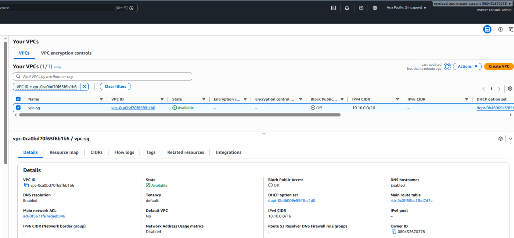
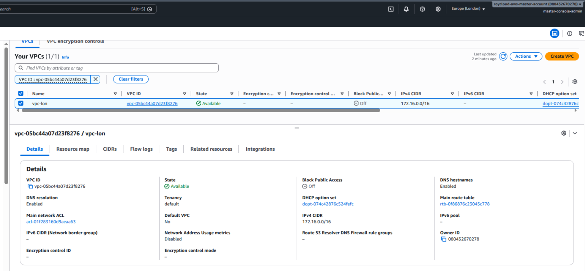
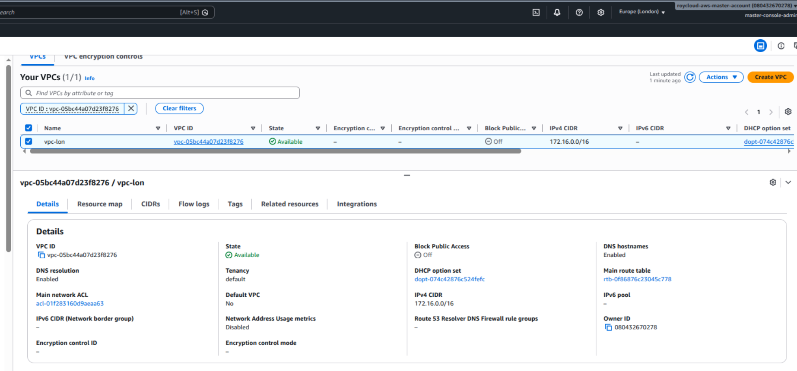

# Step 4 — Create the subnets: subnets.tf

[subnets.tf](../terraform/subnets.tf)


Check the configuration
```bash
terraform fmt
terraform validate
terraform plan
```
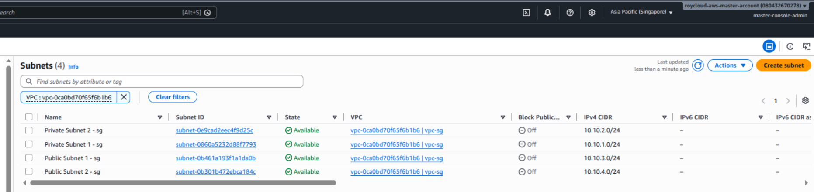
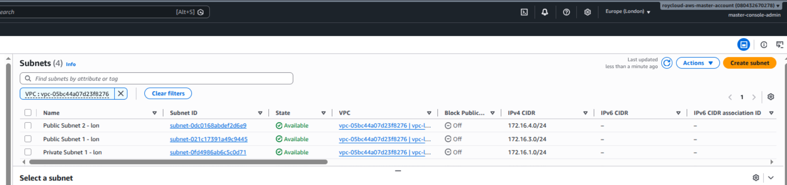
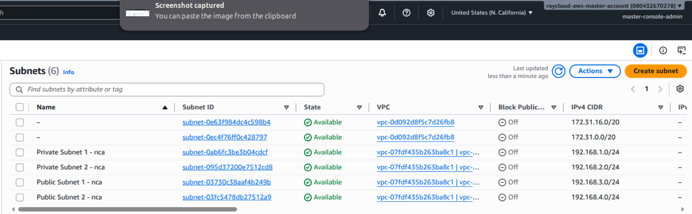


# Step 5 — Create Internet Gateways: internet-gateways.tf

Create internet-gateways.tf in the root module directory:

[internet-gateways.tf](../terraform/internet-gateways.tf)

Check the configuration:
```bash
terraform fmt
terraform validate
terraform plan
```
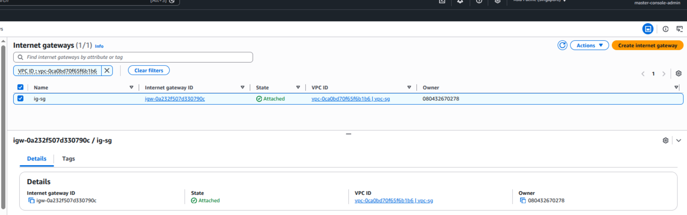
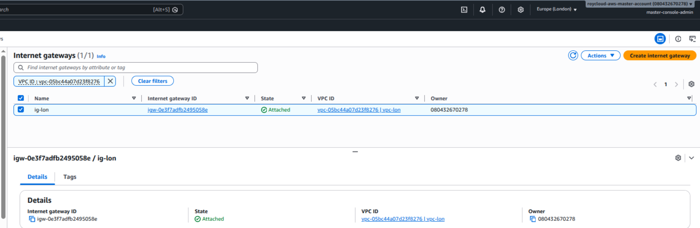
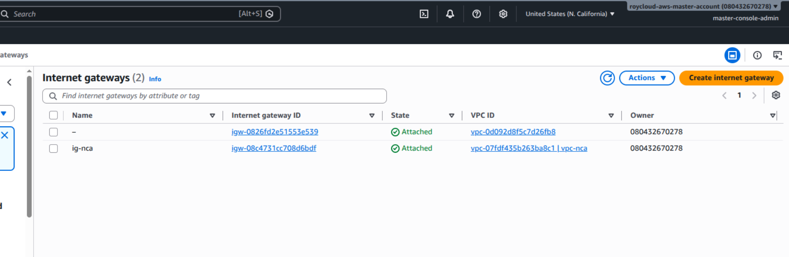

# Step 6 — Public route tables: public-route-tables.tf

[route-table.tf](../terraform/public-route-table.tf)

Check the configuration:
```bash
terraform fmt
terraform validate
terraform plan
```
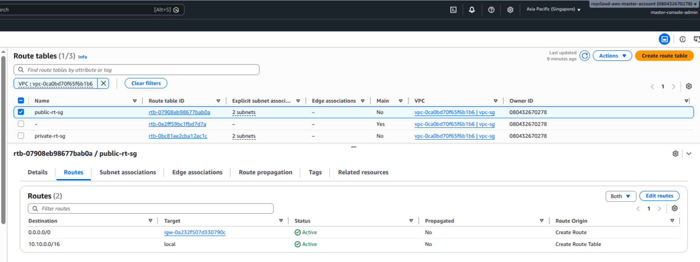
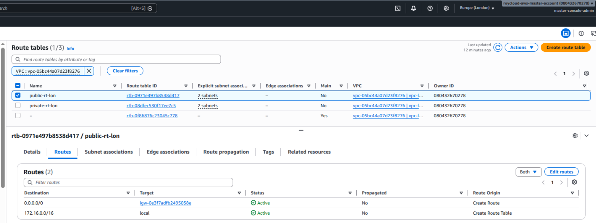
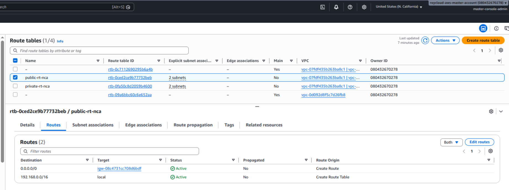

# Step 7 — NAT gateways: `nat-gateways.tf`

Create **`nat-gateways.tf`**:

[nat-gateways.tf](../terraform/nat-gateways.tf)

**Check the configuration:**
```bash
terraform fmt
terraform validate
terraform plan
```
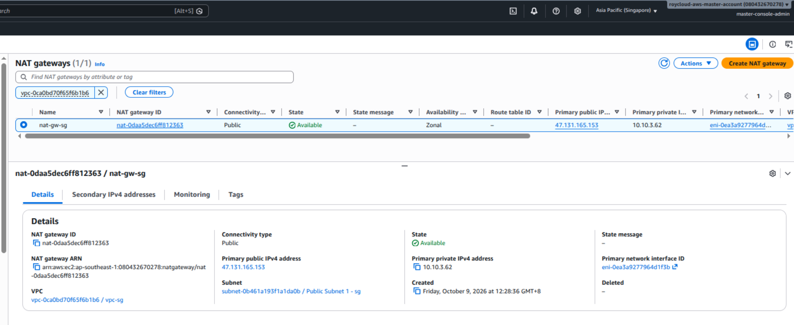
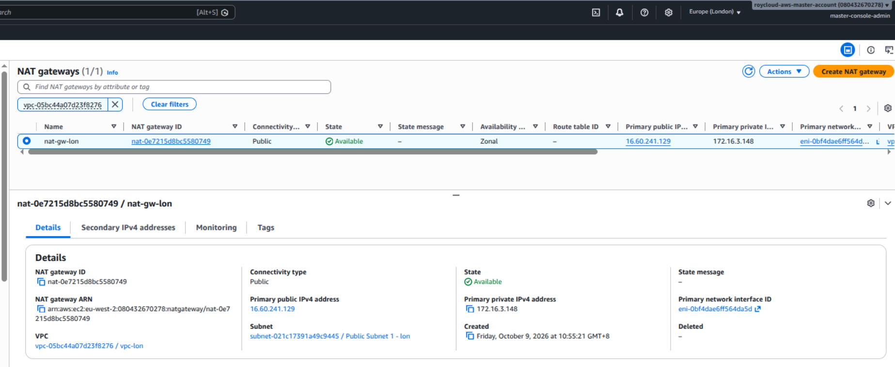
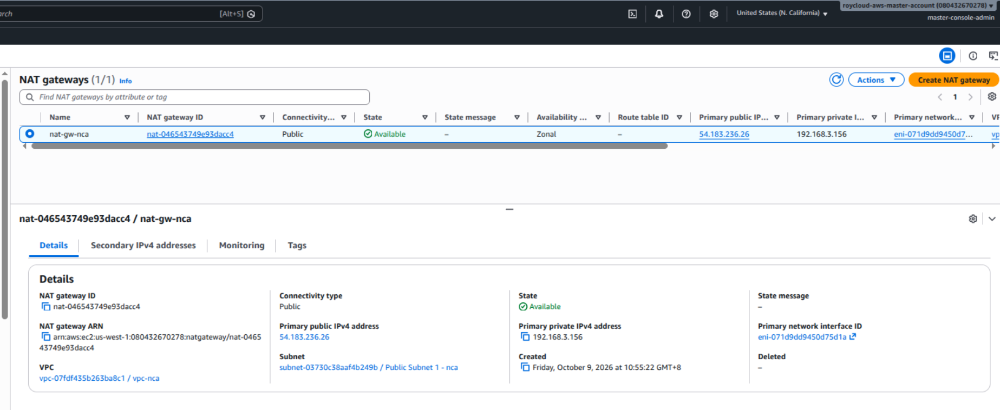

This file adds **3 Elastic IPs + 3 NAT gateways**.

# Step 8 — Private route tables: `private-route-tables.tf`

[private-route-table.tf](../terraform/private-route-table.tf)

**Check the configuration:**

```bash
terraform fmt
terraform validate
terraform plan
```
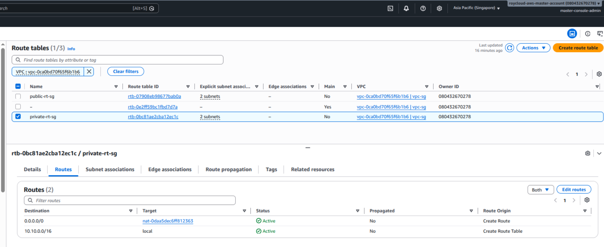
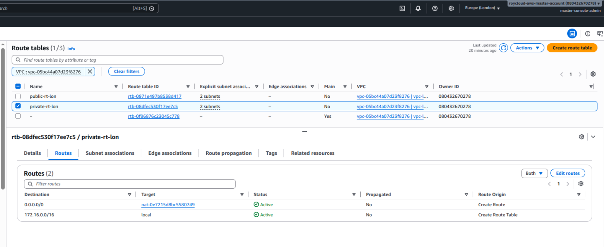
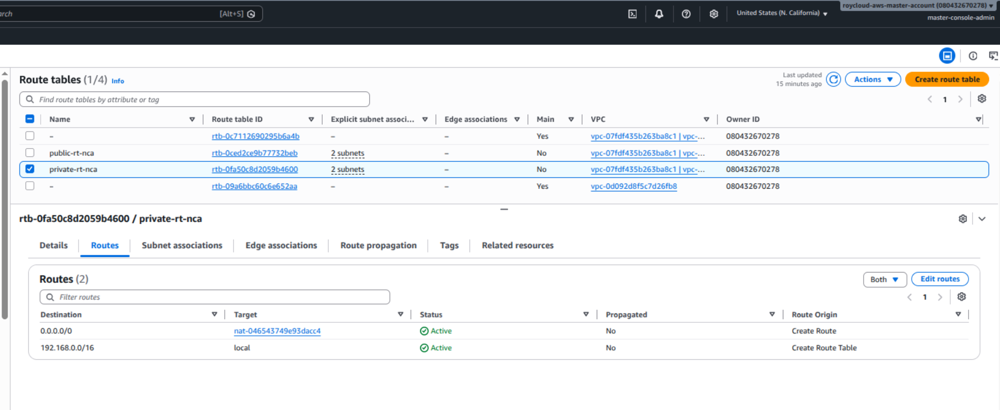

This file adds **3 route tables + 3 routes + 6 subnet associations**.

# Step 9 — Security groups and inbound,outbound rules

Create **`security-groups.tf`**:

[security-groups.tf](../terraform/main.tf)

**Check the configuration:**

```bash
terraform fmt
terraform validate
terraform plan
```
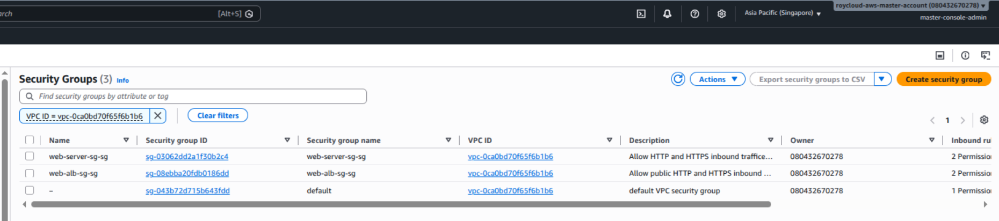
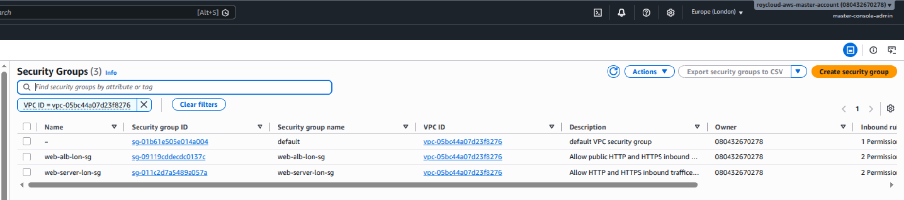
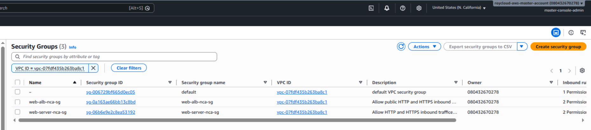

# Step 10 — EC2 management role: `iam.tf`

Create **`iam.tf`**:

[iam-role-policy](../terraform/iam.tf)

**Check the configuration:**

```bash
terraform fmt
terraform validate
terraform plan
```
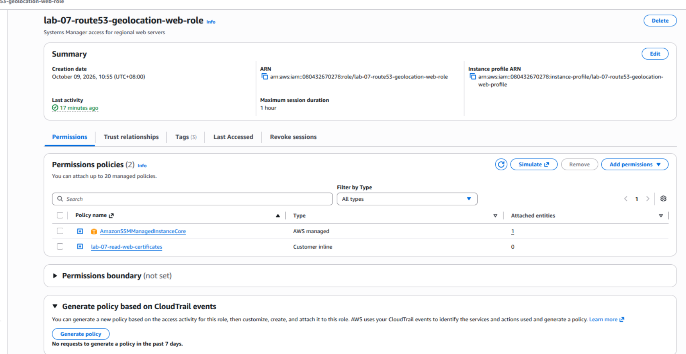
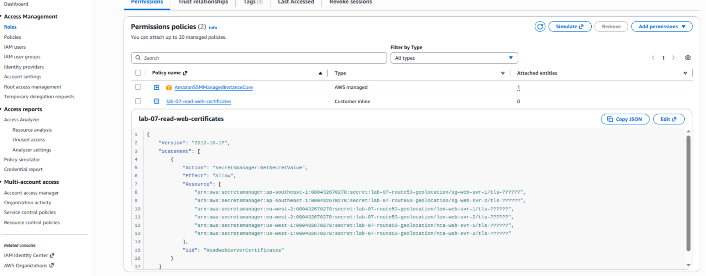

This file adds **3 resources**:

- One IAM role.
- One managed-policy attachment.
- One instance profile.

The total plan count depends on your updated security-group configuration.

# Step 11 — Regional AMI lookup: `data.tf`

Create **`data.tf`**:
[data.tf](../terraform/data.tf)


**Check the configuration:**

```bash
terraform fmt
terraform validate
terraform plan
```

# Step 12 — Create the root CA locally

**1. Prepare a directory outside the GitHub repository**

```bash
mkdir -p lab-07-pki/{private,certs,csr,extensions}
cd lab-07-pki

chmod 700 private
umask 077
```

**2. Generate the root CA private key**

```bash
openssl genpkey \
  -algorithm RSA \
  -aes-256-cbc \
  -pkeyopt rsa_keygen_bits:4096 \
  -out private/root-ca.key
```

```bash
chmod 600 private/root-ca.key
```
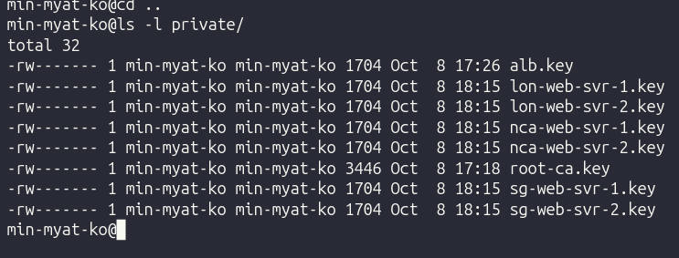

**3. Create the self-signed root CA certificate**

```bash
openssl req \
  -new \
  -x509 \
  -sha256 \
  -days 3650 \
  -key private/root-ca.key \
  -out certs/root-ca.crt \
  -subj "/O=Min Myat Ko Cloud Lab/CN=Lab 07 Root CA" \
  -addext "basicConstraints=critical,CA:TRUE,pathlen:0" \
  -addext "keyUsage=critical,keyCertSign,cRLSign" \
  -addext "subjectKeyIdentifier=hash"
```
Enter the private-key password when prompted.

```bash
chmod 644 certs/root-ca.crt
```
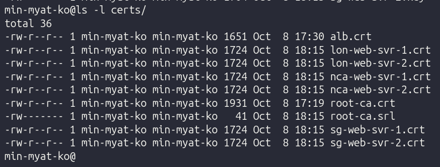

**4. Inspect and verify**

```bash
openssl x509 \
  -in certs/root-ca.crt \
  -noout \
  -subject \
  -issuer \
  -dates
```
```text
subject=O=Min Myat Ko Cloud Lab, CN=Lab 07 Root CA
issuer=O=Min Myat Ko Cloud Lab, CN=Lab 07 Root CA
notBefore=Oct  8 09:19:02 2026 GMT
notAfter=Oct  5 09:19:02 2036 GMT
```
For a self-signed root, the subject and issuer should match.

```bash
openssl verify \
  -CAfile certs/root-ca.crt \
  certs/root-ca.crt
```
Expected:

```text
certs/root-ca.crt: OK
```

This verifies against the explicitly supplied trust anchor; it does not install trust in your browser or operating system.

# Step 13 — Create the ALB server certificate

I create a certificate for **`geo.minracle.com`**, the shared hostname for all three regional ALBs. Change this hostname before running the commands if you prefer another name.

**1. Return to the certificate workspace**

```bash
cd ~/lab-07-pki
umask 077

LAB_HOST="geo.minracle.com"
```

**2. Generate the ALB private key**

```bash
openssl genpkey \
  -algorithm RSA \
  -pkeyopt rsa_keygen_bits:2048 \
  -out private/alb.key

chmod 600 private/alb.key
```


**3. Generate the certificate signing request**

```bash
openssl req \
  -new \
  -sha256 \
  -key private/alb.key \
  -out csr/alb.csr \
  -subj "/O=Min Myat Ko Cloud Lab/CN=geo.minracle.com"
```
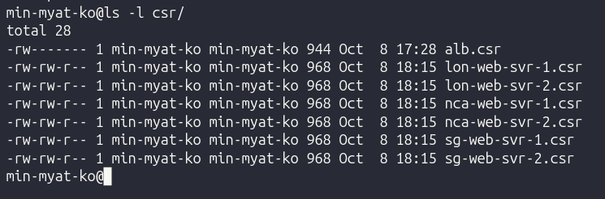

**4. Define the server certificate extensions**

```bash
cat > extensions/alb.ext <<EOF
basicConstraints = critical,CA:FALSE
keyUsage = critical,digitalSignature,keyEncipherment
extendedKeyUsage = serverAuth
subjectAltName = DNS:geo.minracle.com
subjectKeyIdentifier = hash
authorityKeyIdentifier = keyid,issuer
EOF
```

| Extension | Purpose |
|---|---|
| `CA:FALSE` | Identifies a server certificate, rather than a CA. |
| `serverAuth` | Allows TLS server authentication. |
| `subjectAltName` | Specifies the hostname clients will verify. |


**5. Sign the certificate with the root CA**

```bash
openssl x509 \
  -req \
  -sha256 \
  -days 365 \
  -in csr/alb.csr \
  -CA certs/root-ca.crt \
  -CAkey private/root-ca.key \
  -CAcreateserial \
  -extfile extensions/alb.ext \
  -out certs/alb.crt

chmod 644 certs/alb.crt
```
Enter the root CA key’s password when prompted. `-CAcreateserial` creates a serial-number file if needed; retain it for subsequent certificate signing.


**6. Verify the certificate and hostname**

```bash
openssl verify \
  -CAfile certs/root-ca.crt \
  -purpose sslserver \
  -verify_hostname "geo.minracle.com" \
  certs/alb.crt
```

Expected:

```text
certs/alb.crt: OK
```

Inspect the certificate:

```bash
openssl x509 \
  -in certs/alb.crt \
  -noout \
  -subject \
  -issuer \
  -dates \
  -ext subjectAltName
```
```text
subject=O=Min Myat Ko Cloud Lab, CN=geo.minracle.com
issuer=O=Min Myat Ko Cloud Lab, CN=Lab 07 Root CA
notBefore=Oct  8 09:29:51 2026 GMT
notAfter=Oct  8 09:29:51 2027 GMT
X509v3 Subject Alternative Name: 
    DNS:geo.minracle.com
```

**important**
```text
DNS:geo.minracle.com
```

**Files for the upcoming ACM import**

| ACM field | Local file |
|---|---|
| Certificate body | `certs/alb.crt` |
| Certificate private key | `private/alb.key` |
| Certificate chain | `certs/root-ca.crt` |

# Step 14 — Import the ALB certificate into ACM

I import the certificate for **`geo.minracle.com`** into each Region. Each ALB needs an ACM certificate in its own Region.

**1. Verify the certificate before importing**

```bash
cd ~/lab-07-pki

openssl verify \
  -CAfile certs/root-ca.crt \
  -purpose sslserver \
  -verify_hostname geo.minracle.com \
  certs/alb.crt
```

Expected:

```text
certs/alb.crt: OK
```

**2. Import into Singapore**

```bash
aws acm import-certificate \
  --region ap-southeast-1 \
  --profile terraform-cli-admin \
  --certificate fileb://certs/alb.crt \
  --private-key fileb://private/alb.key \
  --certificate-chain fileb://certs/root-ca.crt \
  --tags Key=Project,Value=lab-07-route53-geolocation \
  --query CertificateArn \
  --output text
```
arn:aws:acm:ap-southeast-1:080432670278:certificate/3c976907-c8fe-42f1-9c84-a7fd9971ec30
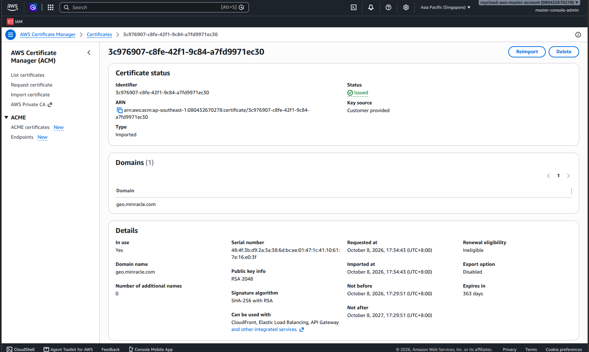

**3. Import into London**

```bash
aws acm import-certificate \
  --region eu-west-2 \
  --profile terraform-cli-admin \
  --certificate fileb://certs/alb.crt \
  --private-key fileb://private/alb.key \
  --certificate-chain fileb://certs/root-ca.crt \
  --tags Key=Project,Value=lab-07-route53-geolocation \
  --query CertificateArn \
  --output text
```
arn:aws:acm:eu-west-2:080432670278:certificate/ba4deb21-259e-4443-bb1d-4b7dac8e47f6
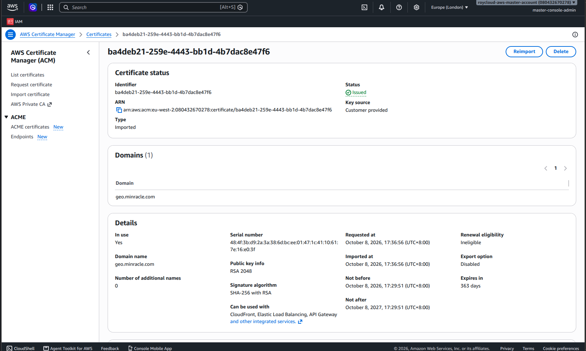

**4. Import into Northern California**

```bash
aws acm import-certificate \
  --region us-west-1 \
  --profile terraform-cli-admin \
  --certificate fileb://certs/alb.crt \
  --private-key fileb://private/alb.key \
  --certificate-chain fileb://certs/root-ca.crt \
  --tags Key=Project,Value=lab-07-route53-geolocation \
  --query CertificateArn \
  --output text
```
arn:aws:acm:us-west-1:080432670278:certificate/af780a01-6681-4446-adfc-f13aed4d7d90
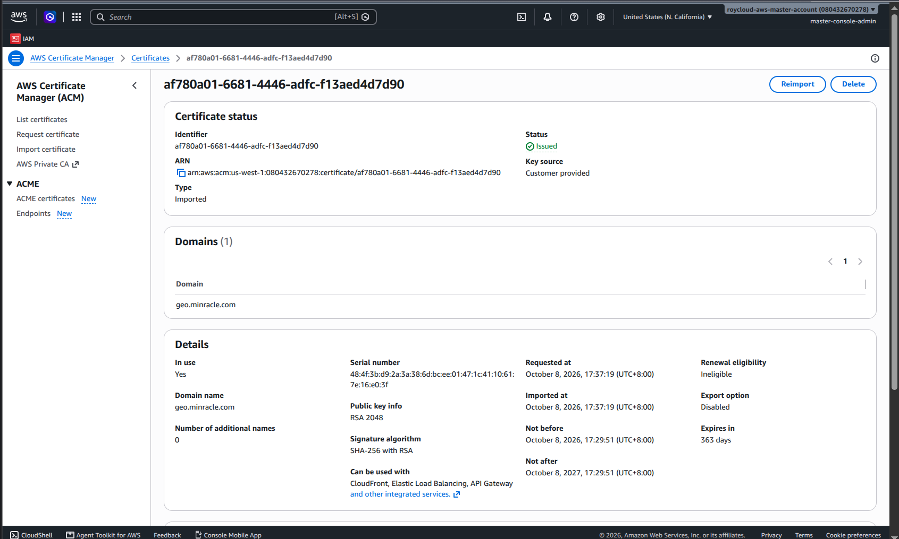


**5. Check in the AWS console**

Open **AWS Certificate Manager** in each Region and confirm:

- Domain: `geo.minracle.com`
- Type: `Imported`
- Status: `Issued`
- Expiration date matches the generated certificate.

`Issued` confirms availability in ACM; it does not mean browsers automatically trust your private CA. Client trust will be configured separately.

These CLI-created certificates are outside Terraform management for now. Referencing their ARNs later will not make Terraform delete them during cleanup.


# Step 15 — Create the EC2 backend certificates

I generate a separate private key and certificate for each web server, signed by the existing root CA.

| Server | Certificate hostname |
|---|---|
| Singapore 1 | `sg-web-svr-1.internal.minracle.com` |
| Singapore 2 | `sg-web-svr-2.internal.minracle.com` |
| London 1 | `lon-web-svr-1.internal.minracle.com` |
| London 2 | `lon-web-svr-2.internal.minracle.com` |
| Northern California 1 | `sfo-web-svr-1.internal.minracle.com` |
| Northern California 2 | `sfo-web-svr-2.internal.minracle.com` |

These names identify the certificates. We do not need DNS records for them when the ALB connects to registered EC2 targets by private IP.

**1. Return to the local workspace**

```bash
cd ~/lab-07-pki
umask 077
```

**2. Generate and verify all six certificates**

Run this loop once:

```bash
(
  set -euo pipefail

  for SERVER_NAME in \
    sg-web-svr-1 \
    sg-web-svr-2 \
    lon-web-svr-1 \
    lon-web-svr-2 \
    nca-web-svr-1 \
    nca-web-svr-2
  do
    SERVER_DNS="${SERVER_NAME}.internal.minracle.com"

    # Generate the server's private key
    openssl genpkey \
      -algorithm RSA \
      -pkeyopt rsa_keygen_bits:2048 \
      -out "private/${SERVER_NAME}.key"

    chmod 600 "private/${SERVER_NAME}.key"

    # Generate the certificate signing request
    openssl req \
      -new \
      -sha256 \
      -key "private/${SERVER_NAME}.key" \
      -out "csr/${SERVER_NAME}.csr" \
      -subj "/O=Min Myat Ko Cloud Lab/CN=${SERVER_DNS}"

    # Define server certificate extensions
    cat > "extensions/${SERVER_NAME}.ext" <<EOF
basicConstraints = critical,CA:FALSE
keyUsage = critical,digitalSignature,keyEncipherment
extendedKeyUsage = serverAuth
subjectAltName = DNS:${SERVER_DNS},DNS:localhost,IP:127.0.0.1
subjectKeyIdentifier = hash
authorityKeyIdentifier = keyid,issuer
EOF

    # Sign with the existing root CA
    openssl x509 \
      -req \
      -sha256 \
      -days 365 \
      -in "csr/${SERVER_NAME}.csr" \
      -CA certs/root-ca.crt \
      -CAkey private/root-ca.key \
      -CAcreateserial \
      -extfile "extensions/${SERVER_NAME}.ext" \
      -out "certs/${SERVER_NAME}.crt"

    chmod 644 "certs/${SERVER_NAME}.crt"

    # Verify the chain, server purpose, and hostname
    openssl verify \
      -CAfile certs/root-ca.crt \
      -purpose sslserver \
      -verify_hostname "${SERVER_DNS}" \
      "certs/${SERVER_NAME}.crt"
  done
)
```

Enter the root CA password when prompted for each certificate.

Expected verification results:

```text
certs/sg-web-svr-1.crt: OK
certs/sg-web-svr-2.crt: OK
certs/lon-web-svr-1.crt: OK
certs/lon-web-svr-2.crt: OK
certs/sfo-web-svr-1.crt: OK
certs/sfo-web-svr-2.crt: OK
```

The additional `localhost` and `127.0.0.1` SANs allow local HTTPS verification after installation.

**3. Inspect one certificate**

```bash
openssl x509 \
  -in certs/sg-web-svr-1.crt \
  -noout \
  -subject \
  -issuer \
  -dates \
  -ext subjectAltName
```
```text
subject=O=Min Myat Ko Cloud Lab, CN=sg-web-svr-1.internal.minracle.com
issuer=O=Min Myat Ko Cloud Lab, CN=Lab 07 Root CA
notBefore=Oct  8 10:15:08 2026 GMT
notAfter=Oct  8 10:15:08 2027 GMT
X509v3 Subject Alternative Name: 
    DNS:sg-web-svr-1.internal.minracle.com, DNS:localhost, IP Address:127.0.0.1
```

**Files needed on each EC2 instance**

# Step 16 — Store EC2 certificates in Secrets Manager

**1. Return to the local certificate workspace**

```bash
cd ~/lab-07-pki
```
**2. Upload the six certificate bundles**

Each bundle contains:

| Field | Contents |
|---|---|
| `certificate` | Server certificate |
| `private_key` | That server’s private key |
| `root_ca` | Public root CA certificate |

Run:

```bash
(
  set -euo pipefail
  umask 077

  SECRET_PAYLOAD=$(mktemp)
  trap 'rm -f "$SECRET_PAYLOAD"' EXIT

  for ENTRY in \
    "ap-southeast-1 sg-web-svr-1" \
    "ap-southeast-1 sg-web-svr-2" \
    "eu-west-2 lon-web-svr-1" \
    "eu-west-2 lon-web-svr-2" \
    "us-west-1 nca-web-svr-1" \
    "us-west-1 nca-web-svr-2"
  do
    read -r REGION SERVER_NAME <<< "$ENTRY"

    # Build the JSON bundle without printing private keys
    python3 - "$SERVER_NAME" "$SECRET_PAYLOAD" <<'PY'
import json
import sys
from pathlib import Path

server_name = sys.argv[1]
output_path = Path(sys.argv[2])

bundle = {
    "certificate": Path(f"certs/{server_name}.crt").read_text(),
    "private_key": Path(f"private/{server_name}.key").read_text(),
    "root_ca": Path("certs/root-ca.crt").read_text(),
}

output_path.write_text(json.dumps(bundle))
PY

    aws secretsmanager create-secret \
      --region "$REGION" \
      --profile terraform-cli-admin \
      --name "lab-07-route53-geolocation/${SERVER_NAME}/tls" \
      --description "HTTPS certificate bundle for ${SERVER_NAME}" \
      --secret-string "file://${SECRET_PAYLOAD}" \
      --tags Key=Project,Value=lab-07-route53-geolocation \
      --query ARN \
      --output text
  done
)
```
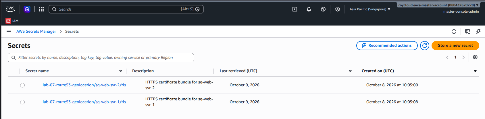


The temporary file is removed when the subshell exits. **The root CA private key is not uploaded.**

**3. Verify the secrets**

Open **AWS Secrets Manager** in each Region:

| Region | Expected secrets |
|---|---|
| Singapore | `…/sg-web-svr-1/tls`, `…/sg-web-svr-2/tls` |
| London | `…/lon-web-svr-1/tls`, `…/lon-web-svr-2/tls` |
| Northern California | `…/sfo-web-svr-1/tls`, `…/sfo-web-svr-2/tls` |


# Step 17 — Allow EC2 to retrieve certificates: update `iam.tf`

I add permission to read the **six lab certificate secrets**. 
The role retains its existing Systems Manager permissions.

**1. Add these blocks to `iam.tf`**

Keep the existing role, policy attachment, and instance profile.

```bash
# Identify the AWS account used by Terraform
data "aws_caller_identity" "current" {
  provider = aws
}

# Allow the shared EC2 role to read the lab certificate bundles
resource "aws_iam_role_policy" "web_server_certificates" {
  provider = aws

  name = "lab-07-read-web-certificates"
  role = aws_iam_role.web_server.name

  policy = jsonencode({
    Version = "2012-10-17"

    Statement = [
      {
        Sid    = "ReadWebServerCertificates"
        Effect = "Allow"
        Action = "secretsmanager:GetSecretValue"

        Resource = [
          "arn:aws:secretsmanager:ap-southeast-1:${data.aws_caller_identity.current.account_id}:secret:lab-07-route53-geolocation/sg-web-svr-1/tls-??????",
          "arn:aws:secretsmanager:ap-southeast-1:${data.aws_caller_identity.current.account_id}:secret:lab-07-route53-geolocation/sg-web-svr-2/tls-??????",
          "arn:aws:secretsmanager:eu-west-2:${data.aws_caller_identity.current.account_id}:secret:lab-07-route53-geolocation/lon-web-svr-1/tls-??????",
          "arn:aws:secretsmanager:eu-west-2:${data.aws_caller_identity.current.account_id}:secret:lab-07-route53-geolocation/lon-web-svr-2/tls-??????",
          "arn:aws:secretsmanager:us-west-1:${data.aws_caller_identity.current.account_id}:secret:lab-07-route53-geolocation/nca-web-svr-1/tls-??????",
          "arn:aws:secretsmanager:us-west-1:${data.aws_caller_identity.current.account_id}:secret:lab-07-route53-geolocation/nca-web-svr-2/tls-??????"
        ]
      }
    ]
  })
}
```

**2. Update the existing instance profile’s dependency**

In `aws_iam_instance_profile.web_server`, replace its current `depends_on` with:

```hcl
depends_on = [
  aws_iam_role_policy_attachment.web_server_ssm,
  aws_iam_role_policy.web_server_certificates
]
```

This ensures both permission configurations complete before Terraform creates the instance profile.

**3. Check the configuration**

```bash
terraform fmt
terraform validate
terraform plan
```
# Step 18 — Simple HTTPS web-server template

Create the directory:

```bash
mkdir -p templates
```

Create **`templates/web-user-data.sh.tftpl`**,
[html-template-web-user-data](/terraform/templates/web-user-data.sh.tftpl)

This local test assumes your regenerated backend certificates include **`DNS:geo.minracle.com`** in their SANs.

**Values for the six servers**

| Server label | Background color | Secret name suffix |
|---|---|---|
| Singapore Web Server 1 | `#D1FAE5` — green | `sg-web-svr-1/tls` |
| Singapore Web Server 2 | `#DBEAFE` — blue | `sg-web-svr-2/tls` |
| London Web Server 1 | `#EDE9FE` — purple | `lon-web-svr-1/tls` |
| London Web Server 2 | `#FCE7F3` — pink | `lon-web-svr-2/tls` |
| Northern California Web Server 1 | `#FFEDD5` — orange | `nca-web-svr-1/tls` |
| Northern California Web Server 2 | `#FEF9C3` — yellow | `nca-web-svr-2/tls` |

Every secret name includes the prefix:

```text
lab-07-route53-geolocation/
```
We will pass these values through `templatefile()` in `ec2.tf`.

**Check shell syntax:**

```bash
bash -n templates/web-user-data.sh.tftpl
```

# Step 19 — Create the private web servers: `ec2.tf`

I create **two EC2 instances per Region**, each in a different private subnet. Each instance uses its own certificate secret and background color.

Create **`ec2.tf`**:

[Web-Server-ec2.tf](../terraform/ec2.tf)

**Template changes replace instances**

```hcl
user_data_replace_on_change = true
```
**Check the configuration:**

```bash
terraform fmt
terraform validate
terraform plan
```


# Step 20 Create **`target-groups.tf`** in the root module.

[target-group-attachment-registered-instances](../terraform/target-groups.tf)

Run:

```bash
terraform fmt
terraform validate
```
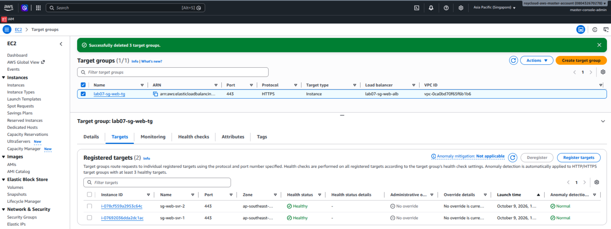
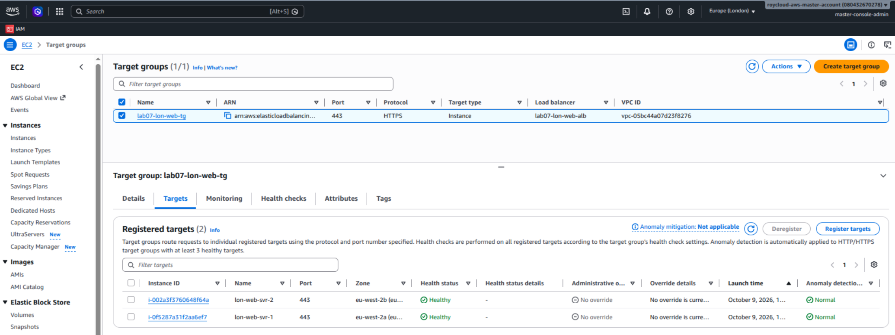
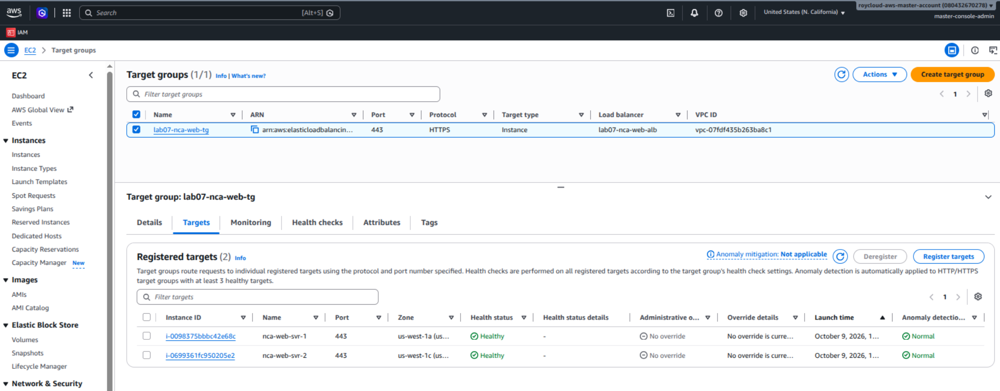

# Step 21 Create **`alb.tf`** in the root module.

I create three public ALBs, each spanning two public subnets in its region.

[alb.tf](../terraform/alb.tf)

Run:

```bash
terraform fmt
terraform validate
```
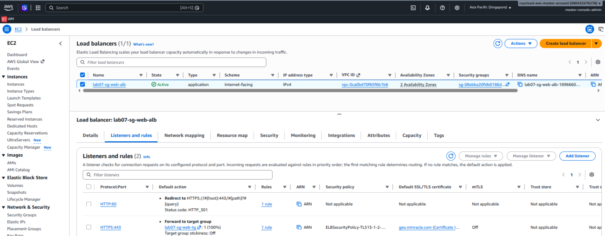
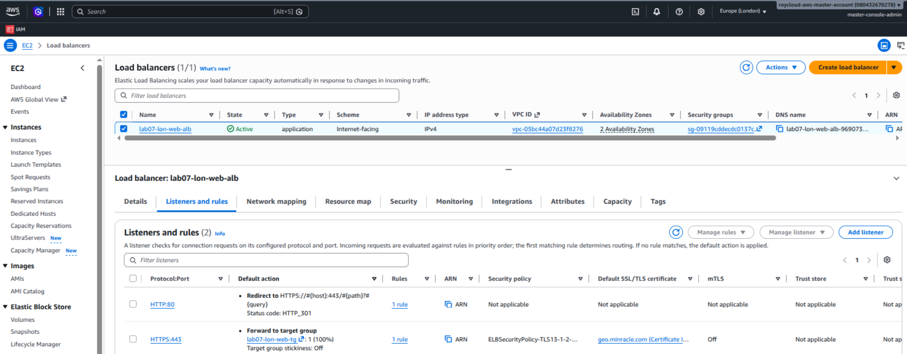
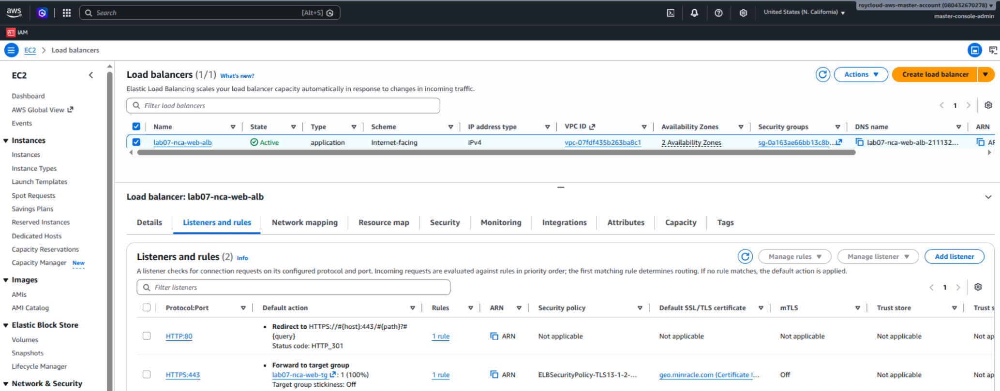

# Step 22 Create **`acm.tf`** in the root module.

I use data sources to find the existing `geo.minracle.com` certificates imported into ACM in each region.

[acm.tf](../terraform/acm.tf)

The next file will reference these ARNs:

```hcl
data.aws_acm_certificate.sg_alb.arn
data.aws_acm_certificate.lon_alb.arn
data.aws_acm_certificate.nca_alb.arn
```

Run:

```bash
terraform fmt
terraform validate
```

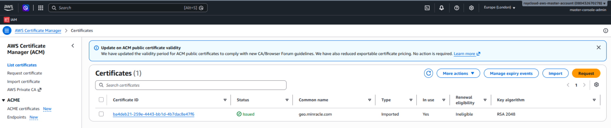
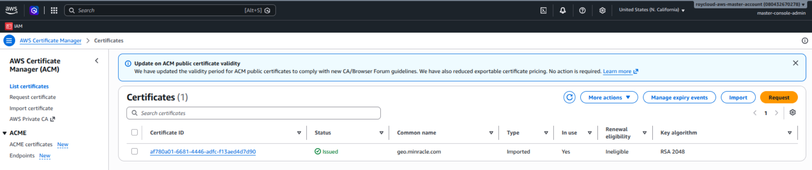


# Step 23 Create **`listeners.tf`** in the root module.

[listener.tf](../terraform/listener.tf)

Run:

```bash
terraform fmt
terraform validate
```


# Step 24 Create **`route53-zone.tf`** in the root module.

[route53.zone.tf](../terraform/route53-zone.tf)

For now, run:

```bash
terraform fmt
terraform validate
```

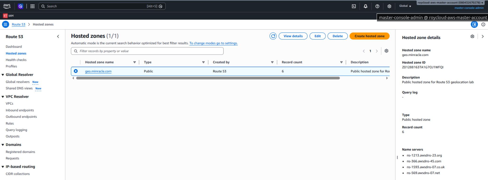

# Step 25 Create **`route53-records.tf`** in the root module.

[routet53-records.tf](../terraform/route53-records)

Run:

```bash
terraform fmt
terraform validate
```

Public DNS resolution will work after delegating `geo.minracle.com` to the hosted zone’s name servers.

# Step 26 Create **`outputs.tf`** in the root module.

[outputs.tf](../terraform/outputs.tf)


```bash
terraform fmt
terraform validate
```
# Step 27 Review the Deployment Plan

I now **validate the configuration and review the deployment plan**.

Run these commands from the `lab-07-route53-geolocation` root directory.

1. Confirm the AWS account used by the provider profile:

```bash
aws sts get-caller-identity \
  --profile terraform-cli-admin
```

2. Initialize Terraform:

```bash
terraform init
```

3. Format and validate the files:

```bash
terraform fmt
terraform validate
```

Expected validation result:

```text
Success! The configuration is valid.
```
4. Generate a saved plan:

```bash
terraform plan -out=lab07.tfplan
```
5. Review the plan:

```bash
terraform show -no-color lab07.tfplan
```

# Step 28 Deploy the reviewed Terraform Plan

 **deploy the reviewed Terraform plan**.

From the lab’s root directory, run:

```bash
terraform apply lab07.tfplan
```

**Applying a saved plan starts immediately without another `yes` prompt.** It creates the resources approved in the plan, including the billable EC2 instances, ALBs, and NAT gateways.

If you changed any Terraform files after generating the plan, regenerate and review it first:

```bash
terraform plan -out=lab07.tfplan
```

When deployment finishes, Terraform displays:

```text
Apply complete! Resources: ... added, ... changed, ... destroyed.
```

Retrieve the name servers for the next step:

```bash
terraform output geo_name_servers
```
# Step 29 Delegate domain to Rotue 53

I now **delegate `geo.minracle.com` to Route 53**.

1. Open the DNS management page for **`minracle.com`** at its current DNS provider. If the parent domain already uses Route 53, open its `minracle.com` hosted zone.

2. Add the following **NS records**:

| Type | Name / Host | Value |
|---|---|---|
| NS | `geo` | `ns-1213.awsdns-23.org` |
| NS | `geo` | `ns-1593.awsdns-07.co.uk` |
| NS | `geo` | `ns-366.awsdns-45.com` |
| NS | `geo` | `ns-569.awsdns-07.net` |

Use **TTL 300 seconds** if supported, or the provider’s default. Some providers accept all four values in one record; others require four entries.

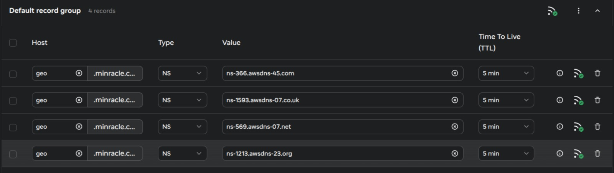

If the provider requires a full hostname, enter `geo.minracle.com` instead of `geo`.

3. Save the records, then check from your PC:

```bash
dig NS geo.minracle.com +short
```

The result should contain the four AWS name servers above. Cached DNS responses may delay the result.

To inspect the delegation path:

```bash
dig +trace NS geo.minracle.com
```
# Step 30 Verify delegation

1. **Verify delegation**
```bash
   dig NS geo.minracle.com +short
```
```bash
   min-myat-ko@dig NS geo.minracle.com +short
ns-569.awsdns-07.net.
ns-1213.awsdns-23.org.
ns-1593.awsdns-07.co.uk.
ns-366.awsdns-45.com.
```
   Confirm the four nameservers match your Route 53 hosted zone.

2. **Check geolocation records**  

   In that hosted zone, confirm the A alias records:
   - Asia → Singapore ALB
   - Europe → London ALB
   - North America → California ALB
   - Default → Singapore ALB

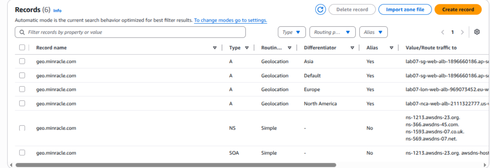
3. **Check backend health**  
   Confirm both EC2 targets in each regional target group are **Healthy**.

4. **Verify DNS and HTTPS**
```bash
   dig A geo.minracle.com +short

   curl --fail --show-error \
     --cacert certs/root-ca.crt \
     https://geo.minracle.com/
```

5. **Test geolocation**  
   Use Urban VPN with locations in Asia, Europe, and North America. Check which regional web page appears.
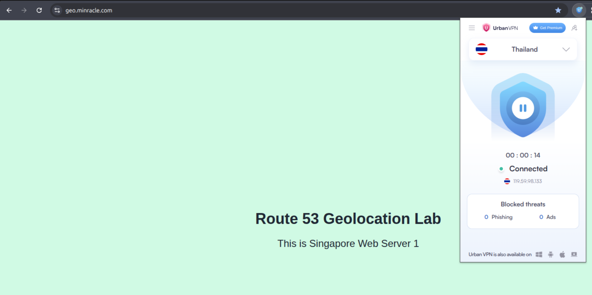
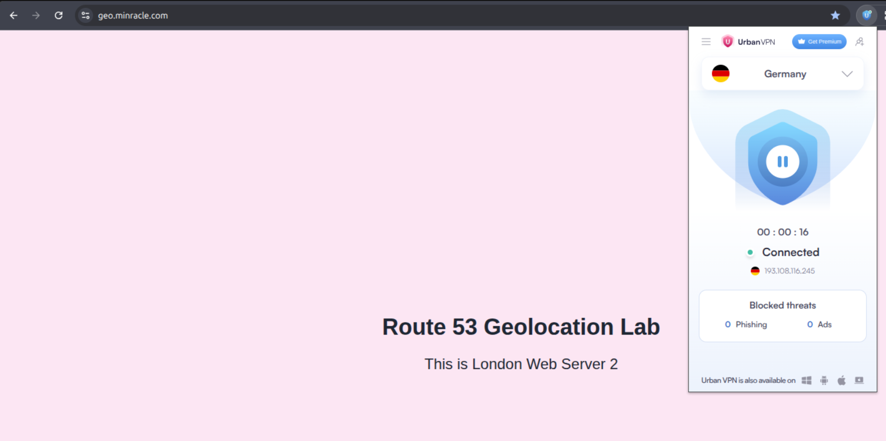
